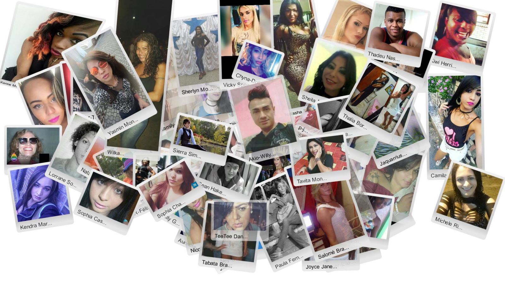
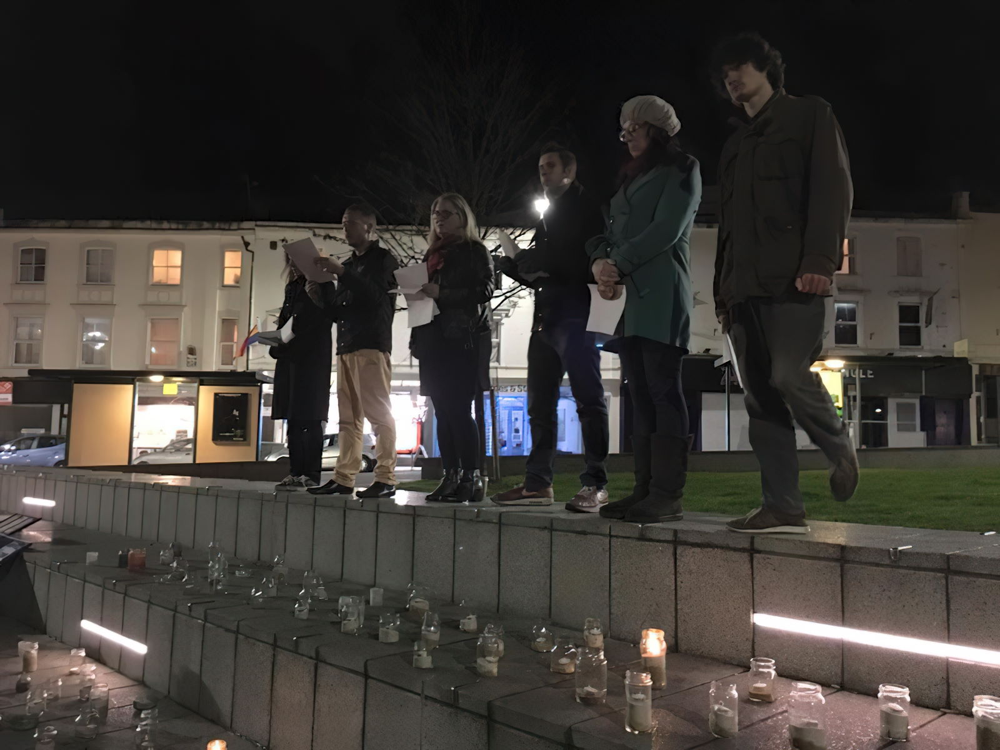
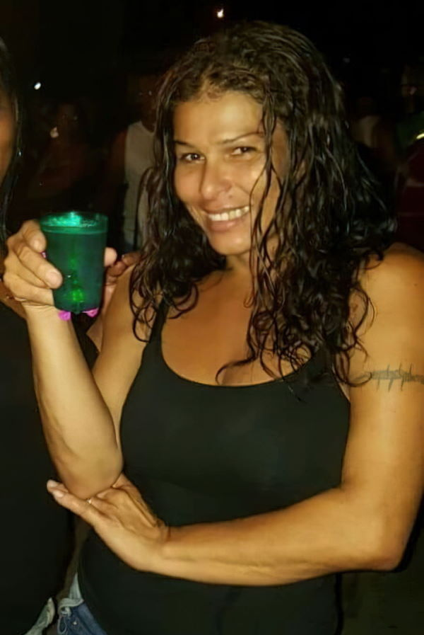

  Just some of the trans people we have lost in the last year. May they rest in peace, and may we remember them.

**[TRIGGER WARNING: VIOLENCE. MURDER]**

Her name was Gwen, but I never knew her.

It was late October 2002, and I was about to leave the family home for the last time. My transition was approaching, my marriage disintegrating and my wife wanted me to move out. I didn't have anywhere to go, but fortunately a good friend (thanks Tracey!) let me stay on her sofa until I found a place to rent.

That proved to be tricky as I was then quite visibly trans and still had to present as male at work until January. Awareness of trans people among the general public was pretty poor at the time, and when I enquired about places to rent I found that landlords just wouldn't get back to me. As a result, I didn't find a new home until [December 2002](https://www.annasplace.me.uk/blog/?archive=2002_12_01_archive.xml#85427302), and even then the landlord was reluctant to consider meeting me (she'd never met a trans person before) until Tracey managed to talk her round over the phone.

Fortunately, once I met my prospective landlord, she was fine (the roadblock was getting past the initial phone enquiry) and that shared house proved to be the safe space I needed for the next two years while I got all of the medical stuff out of the way. I was privileged, and I was lucky.

----

**But I digress.** Until late that October I'd never even heard of the [Transgender day of Remembrance](https://tdor.info/about-2/)….and then one day I read about what had happened to **[Gwen Araujo](https://www.mercurynews.com/2016/10/14/the-murder-of-gwen-araujo/)** in Nevada on 4th October 2002 (just a few weeks before I moved out of the family home) and everything changed.

[@preview Gwen Araujo murder 14 years later: Transgender teen's killers face parole](https://www.mercurynews.com/2016/10/14/the-murder-of-gwen-araujo/)

If you've not heard her story, **Gwen was beaten to death with a shovel at a party by people she thought of as friends**. Afterwards they buried her body in the woods in an attempt to conceal the crime.

Up until then I hadn't been particularly conscious of violence against trans people other than as a personal awareness to be careful of my own safety — but knowing what happened to Gwen changed that. Suddenly, I realised I was far, far more vulnerable than I thought.

For Gwen, there has at least been *some* justice — of the four men involved, two were convicted of second-degree murder, one of voluntary manslaughter and the fourth gave evidence against the other three in return for a sentence of involuntary manslaughter. In 2006, her life was also memorialised in the movie “**[A Girl Like Me: The Gwen Araujo Story](https://www.imdb.com/title/tt0787484/)**”.

[@preview A Girl Like Me: The Gwen Araujo Story](https://www.imdb.com/title/tt0787484/)

However the killers of many murdered trans people do **not** receive justice — and there are far too many of them. Until the **[Transgender Day of Remembrance](https://tdor.info/about-2/)** was started by Gwendolyn Ann Smith to mark the murder of **Rita Hester** on 28th November 1998 (a murder which is *still* unsolved), those deaths would also go largely unreported.

[@preview The Trans Murder That Started a Movement](https://www.thedailybeast.com/the-trans-murder-that-started-a-movement)

What news reports there were frequently misgendered and deadnamed murdered trans people — and this is often still the case today. To quote the article above, when Rita died:

> News outlets like the *Globe* and the *Herald* [referred](https://www.gendertalk.com/language-of-respect/) to Rita as “a transvestite,” as “a man who sported long braids and preferred women's clothes,” and as someone who was living an “apparent double life.” Both papers used male pronouns, even though everyone in the community had known Hester as a woman for years. When transgender advocates protested this misreporting, a [Boston] Phoenix reporter chided them for putting the papers “under the political-correctness microscope.”
>
> “Is Rita Hester's murder being eclipsed by the transgender community's grammatical agenda?” her headline asked, as if insisting on respect for the dead were a distraction from fighting the prejudice that may have led to the murder.
>
> This same reporter, of course, made sure to describe Hester's breasts and genitals — details that served only to exoticize her case.
>
> Adding insult to injury, even the New England gay and lesbian newspaper *Bay Windows* reportedly referred to Rita as “he” and placed her name in quotes.

**This is quite simply not a respectful or fitting way to remember our dead.** Not only is it disrespectful, but also willfully ignorant and transphobic.

**In life, our dead were every bit as varied, creative, compassionate, loving, colourful and broken as the rest of us** so to generalise or judge who they were is quite frankly an appalling thing to do. To disrespect them further by deadnaming and misgendering crosses a line far, far beyond that.

If you didn't know them and want to understand a little — [go and learn about them](https://dorhouston.com/newhome.php) — and even better still — **respect their memory by helping a vulnerable trans person who is still alive**. So many of us need your help.

The really tragic thing about all of this is that each of those we've lost leaves a uniquely *them*-shaped hole which just can't be filled. They're missed by friends, relatives, neighbours, co-workers and those they loved — and even by strangers like me. *They deserve to be* *remembered*.* To be celebrated. To be honoured.*

**That is what Transgender Day of Remembrance ([TDoR](https://twitter.com/search?q=%23TDoR)) is all about**. Since 1999 TDoR events have been held on or around 20th November every year to commemorate all of those we have lost in the past year. Although things have improved for trans people in many countries since then (and there are vastly more of us visible), **the deaths just keep on coming**.

A TDoR event is usually a simple candlelight vigil where we [read the names of our dead and remember what happened to them](https://www.youtube.com/watch?v=8WuvCfCpU9Y) [[*guidance*](https://transgenderdordotcom.files.wordpress.com/2014/10/tdortips.pdf)].

The methodology used to identify those we have lost has evolved since that first TDoR event, and today the most widely recognised source is the list collated by the [Trans Murder Monitoring Project](https://transrespect.org/en/trans-murder-monitoring/) and published by [Transgender Europe](https://tdor.tgeu.org/) (TGEU).

In early November, TGEU release a PDF list giving details of all reported killings they have information for and covering the period 1st October through to 30th September. Invariably, there are more reports almost every year. *

* 162 in [2009](https://transrespect.org/wp-content/uploads/2016/02/TvT_TMM_TDOR2009_Namelist_EN.pdf)
* 178 in [2010](https://transrespect.org/en/transgender-europe-tdor-2010/) *
* 221 in [2011](https://transrespect.org/en/transgender-europe-tdor-2011/)
* 265 in [2012](https://transrespect.org/en/tmm-nov-2012-update/)
* 238 in [2013](https://transrespect.org/en/transgender-europe-tdor-2013/)
* 226 in [2014](https://transrespect.org/en/transgender-europe-tdor-2014/)
* 271 in [2015](https://transrespect.org/en/transgender-day-of-remembrance-15-tmmupdate/)
* 295 in [2016](https://transrespect.org/en/tmm-trans-day-remembrance-2016/)
* 325 in [2017](https://transrespect.org/wp-content/uploads/2017/11/TvT_TMM_TDoR2017_Namelist_EN.pdf) [[blogpost](https://medium.com/@annajayne/tdor-2017-say-their-names-learn-their-stories-remember-them-b81d50fd8ef)]
* **???** in 2018 [[blogpost](https://medium.com/@annajayne/tdor-2018-say-their-names-learn-their-stories-remember-them-2ccdccc9db1a)]

*Some of the data from earlier years runs 20th November — 19th November. In addition, the summary text at the start of the TGEU TDoR 2010 list says it includes 179 victims, but one of those is listed twice (so there were actually 178 recorded)

How much of that increase is due to improved communication and reporting, the increasing visibility of trans people (remember that as we get more visible **the people who want us dead can see more of us too**) or other factors, I can't say. What I *can* say is that every year, we seem to have more trans people to mourn and remember.

**TDoR is painful, but important.** If you still doubt why, please watch the video below.

<iframe width="560" height="315" src="https://www.youtube.com/embed/UgWpGLB-QKI" frameborder="0" allowfullscreen></iframe>

Given all this, it shouldn't be a surprise that the weeks leading up to 20th November are a painful time of year for many trans folks. It's the time when we not only mourn our dead, but are forcibly reminded of our own vulnerability — and of the fact that there are many people in this world even today who would like nothing better than to **torture**, **mutilate **and **kill **us.

Hard though that is to endure, it is also an opportunity to say **“*We remember them. We are here, and we refuse to be afraid of those who hate us*”**.

<iframe width="560" height="315" src="https://www.youtube.com/embed/J4ML2Iabd5U" frameborder="0" allowfullscreen></iframe>

I'm lucky to live in a town (Bournemouth, on the south coast of the United Kingdom) that's quite progressive and has a large LGBTQI+ community, but even here I know of trans people who are regularly on the receiving end of abuse in the street. I'm under no illusions that it's actually *safe, *but I also know that we're in a much safer place than most trans people in the world.

Here in Bournemouth the Transgender Day of Remembrance has been marked in various ways for a few years now, but for the last couple of years there has been a well attended candlelight vigil in the Triangle at the top of the town centre (historically an LGBTQI+ area).

  The TDoR vigil in Bournemouth in November 2015. Photo: [Flirt Cafe Bar](https://www.facebook.com/FriendsAtFlirt/).

This year four local groups ([Communi-T](https://www.facebook.com/CommuniTPublicpage/), [Space Youth Project](https://www.spaceyouthproject.co.uk/), [KissNmakeup ](https://www.facebook.com/groups/101213788878/about/)and [Metropolitan Community Church of Bournemouth](https://www.facebook.com/groups/MCCBournemouth/) *) have come together to organise different aspects of the [vigil](https://www.facebook.com/events/1697752580294902/). Preceding that there will also be a TDoR memorial service at Metropolitan Community Church of Bournemouth in Pokesdown, which this year will be at [11am on Sunday 19th November 2017](https://www.facebook.com/events/802479046597979/).

* The Metropolitan Community Church of Bournemouth has since been renamed to **[Inclusive Community Church](https://www.inclusive.church/)**.

One of the things we wanted to do for the vigil is print a laminated sheet in the colours of the trans flag for each victim so that attendees could light a candle for them. I volunteered to collate the data from TGEU and convert it into a form (a spreadsheet, basically) we could use to generate the materials we need, and it struck me that if we were able to add photos for at least some of them it would help everyone to visualise those we mourn.

**I honestly didn't know what I was letting myself in for.** I started by searching [PinkNews](https://www.pinknews.co.uk/), as they routinely report on the killings of trans people in the UK and USA, and occasionally also from elseware in the world. It didn't take long to find an article which listed every victim in the USA, and that gave me enough information to find appropriate photos for almost all of them.

[@preview 2017 is now the deadliest year for transgender people on record](https://www.pinknews.co.uk/2017/10/30/2017-is-now-the-deadliest-year-for-transgender-people-in-the-us-on-record/)

At this point the official list hadn't yet been published (it tends to come out only about 10 days before the vigils take place), so I put everything I found into a spreadsheet and wrote the narratives myself from the news reports.

It was a sobering experience, and it didn't take long before something I read hit me hard. That something was what happened to **Ally Steinfeld** in Texas County, Missouri on 3rd September 2017.

[@preview Murdered trans teen had her genitals mutilated before she was set on fire](https://www.pinknews.co.uk/2017/09/26/murdered-transgender-teen-had-her-genitals-mutilated-before-she-was-set-on-fire/)

**Ally was just 17, and was killed by people she trusted** — one of whom she had been *dating*. Not content with killing her, *they gouged out her eyes and genitals* before burning her body and hiding it inside a garbage bag in a chicken coop. I just can't even begin to process this, and the parallels to what happened to Gwen Araujo all the way back in October 2002 are unmistakable. Has so little changed?

The report about Ally brought on the tears I knew would come sooner or later….but I knew somehow I had to cope with that. I carried on, and eventually I had data on all of the US deaths I knew of. I then started looking to see what I could find on murders elseware in the world.

Knowing that the country with the most reported killings of trans people is **Brazil**, I next started looking for sources I could use to find any information from there.

[@preview One LGBT person is killed every 25 hours in Brazil](https://www.pinknews.co.uk/2017/01/28/one-lgbt-person-is-killed-every-25-hours-in-brazil/)

The best sources I found were two blogs - http://goqueer.blogspot.com/ and https://homofobiamata.wordpress.com - which linked to the primary news sources. It was at that point that I discovered that Brazilian news sites tend to publish graphic photos of the victims corpses.

**Be warned that if you view either of these links you will see things that will almost probably haunt you — they certainly do me.**

[TW: MURDER. GRAPHIC IMAGES]

[@preview Who Has Homophobia Killed Today?](https://homofobiamata.wordpress.com)

Reading European and US based reports about murdered trans people is difficult enough, but Latin American blogs and news reports take it to entirely another level. The sheer horror of it all was overwhelming, but still I read report after report, using [Google Translate](https://translate.google.com) to try to understand what happened to each of them.

Just seeing their smiling faces and knowing what happened to them proved to be enough to reduce me to tears time after time. Even now, just *thinking* about them can do the same thing.

And yet, there is a form of closure and even peace in undertaking such a macabre task. Although all of our instincts are to keep as far away from such horrific deaths as possible, **it feels like the right thing to do**. *We owe it to them to share their stories. To share their smiles, hopes and dreams. To remember.*

I won't pull any punches here— looking at all of this was was a numbing experience. Report after report. Life brutally ended after life brutally ended. Bloodstained corpse after bloodstained corpse….and yet, somehow it all had to be recorded.

But then I saw the report about what happened to Wilka in Vitória de Santo Antão on 26th March 2017.

Like Gwen, I never knew her, but looking at her photo she comes over as someone I could so easily imagine sharing a drink and a laugh with.

  Wilka was [stabbed to death](https://www.pinknews.co.uk/2017/04/02/trans-woman-dies-after-being-stabbed-in-the-neck-in-brazil/) on 26th March 2017.

The report about her death hit me even harder than any of the others. Not only because I felt I could so relate to the sort of person she appeared to be, but the [report of her murder](https://homofobiamata.wordpress.com/2017/03/26/wilka-40-anos-facadas-vitoria-de-sto-antao-pe/) [TW: GRAPHIC IMAGES] included close-up shots of her corpse with the knife wounds clearly visible. The contrast couldn't be more jarring or upsetting.

A translation of the text in the report reads:

> A transgender woman, known as Wilka, was brutally murdered by knife in the city of Vitória de Santo Antão, in the northeastern state of Pernambuco. She was badly stabbed three times: in the neck, in the abdomen and in the back.

In another report, a friend reported that “[someone tried to rob Wilka and murdered her when they realised she was transgender](https://www.pinknews.co.uk/2017/04/02/trans-woman-dies-after-being-stabbed-in-the-neck-in-brazil/)”.

At this point it all overwhelmed me and I broke. **How could anyone do this?**

Even now — nearly a week later — I still feel the tears come when I see her picture in particular. Maybe that will change in time, but I wonder if it even *should*.

That wasn't the end, of course…and many tears still lay ahead. I read about the horrors that overtook **[Dandara dos Santos](https://www.nytimes.com/2017/03/08/world/americas/brazil-transgender-killing-video.html)** (publicly tortured and beaten to death, with her murder videoed and uploaded to YouTube), **[Raina Aliev](https://www.gaystarnews.com/article/transgender-muslim-woman-hacked-death-russia-days-marrying-man)** (hacked to death after her father called for her execution, just days after marrying), **[Michelle Rios](https://www.facebook.com/michele.rios.5680)** (murdered inside her own home), **[Julhão Petruck](https://www.facebook.com/juliao.petruquio.961)** (shot 7 times while leaving his home), **[Agatha Lios](https://www.facebook.com/agatha.liosii.3)** (stabbed, possibly on the instigation of a female pimp) and so, so many more.

By the time I called it all a day on Monday lunchtime I'd found photos of a total of 106 of our dead (nearly a third of the total), and 9 of them aren't even on the official TDoR list. [I've collated the data into a zipfile](https://tdor.translivesmatter.info/reports?from=2016-10-01&to=2017-09-30&country=all&filter=&action=export&sortby=date&sortup=1) containing a spreadsheet and the individual photos as well as a copy of the official PDF so that others can use it for their own TDoR vigils if they wish.

Given all of this it shouldn't be surprising that right now I feel completely drained, but I know the week isn't over yet. **So much loss…so much** ***unnecessary*** **loss. And for what, exactly?**

I'll finish with two thoughts.

The first is the depressing one that **[the victims we will be mourning at TDoR 2018](https://web.archive.org/web/20171103012814/http://sdgln.com/news/2017/11/02/candace-towns-trans-woman-color-found-murdered) have already started being reported on** - I have photos and details for 3 of them already, and I know there are more in the blogs I can't face looking at just yet.

So if you happen to know any trans people (and especially any who seem to be struggling), **please look out for them. Ask them if they are OK, and what you can do to help.**

The second is that Ally Steinfeld's last post on [Facebook](https://www.hrc.org/news/hrc-mourns-the-loss-of-ally-steinfeld-a-trans-teen-murdered-in-missouri) was about dyeing her hair. In the voice of the teenage girl she was, she said:

> “I feeling little bit beautiful how likes my hair i got it red.”

To Ally and all of those we have lost we say — “Rest in peace. Most of us may not have known you, but we all miss you. We promise that we won't forget.”

So *please* **remember our dead, and fight like hell for the living.**

Because it's nowhere near over.

----

**Postscript:** Since writing this I've published everything I've learnt about all of those we've lost in a follow-up blogpost. I encourage you to read it and learn about them.

[@preview TDoR 2017: Say their names. Learn their stories. Remember them](/blog/2017/11/24/tdor-2017-say-their-names-read-their-stories-remember-them_94cc5399)

----

***About The Author***

*[Anna-Jayne Metcalfe](https://www.annasplace.me.uk/about) is a software engineer who volunteers to help research, collate and share data on violence against trans people. This blogpost was originally published by Anna on [Medium](https://annajayne.medium.com/remembering-our-dead-never-gets-any-easier-befb5d7ee7cc).*
