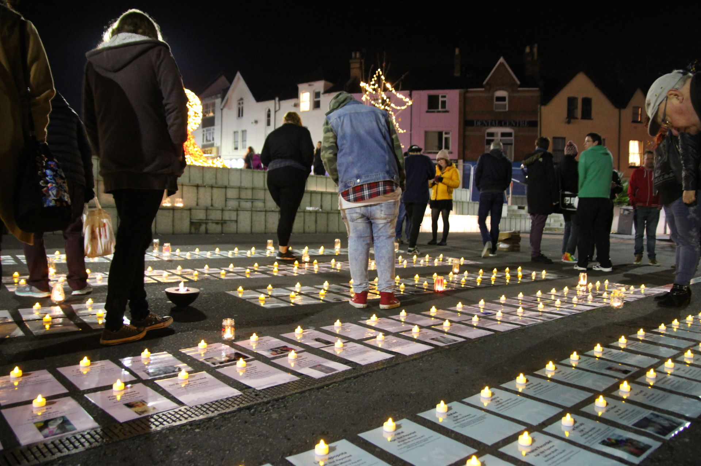
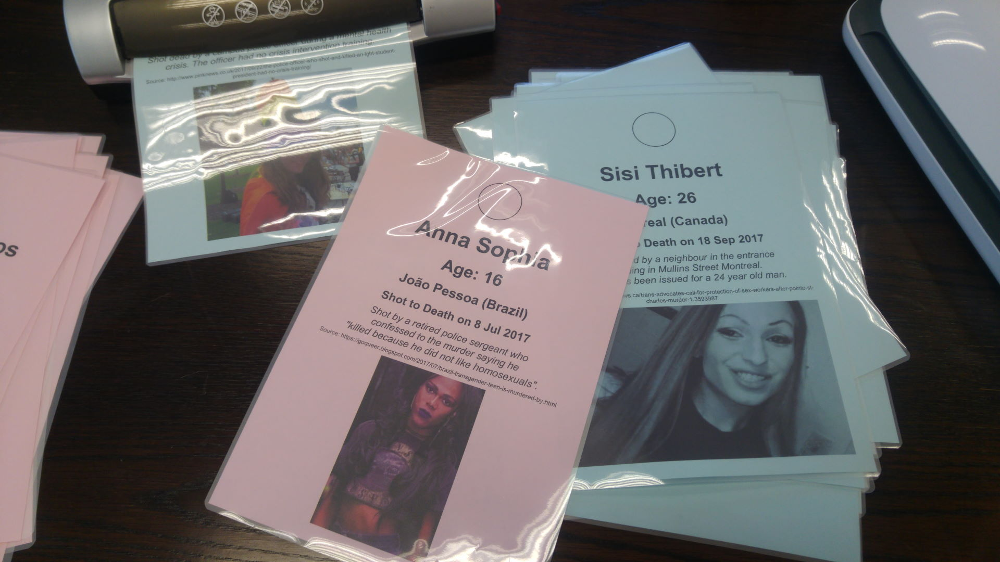
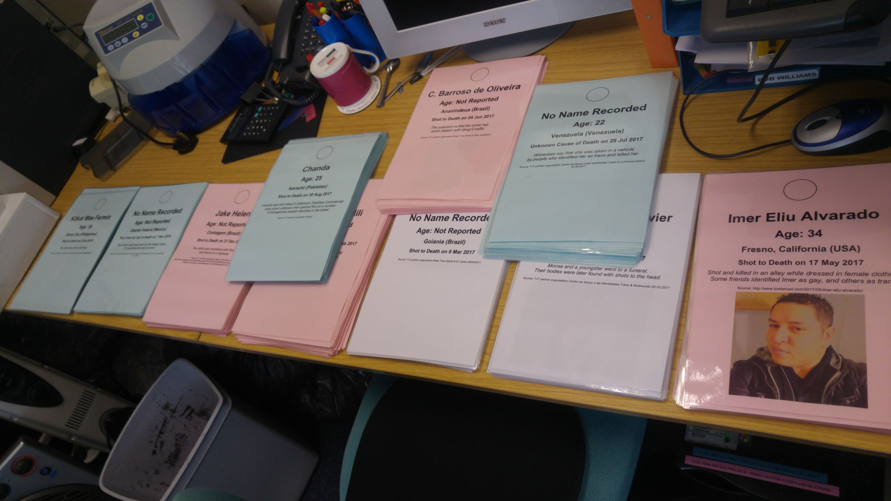
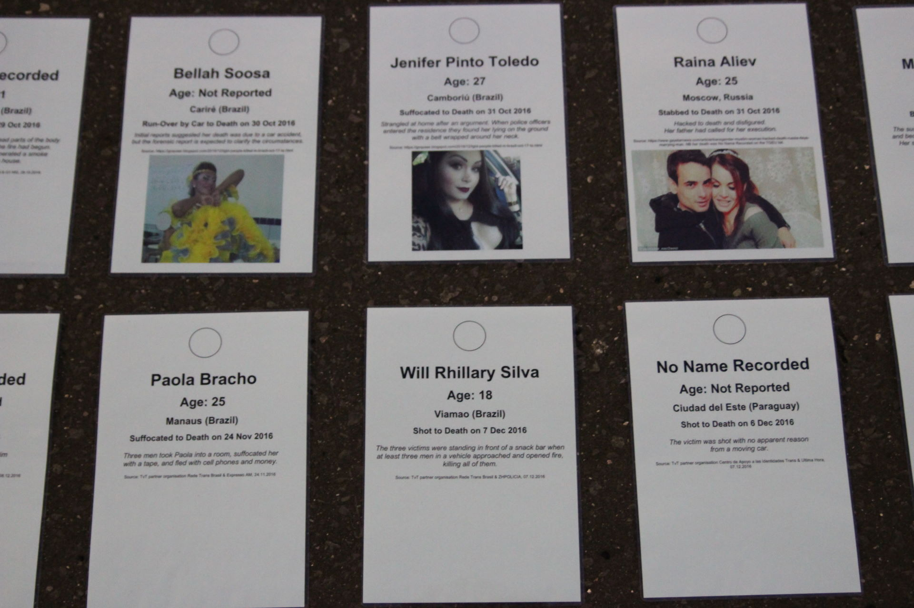
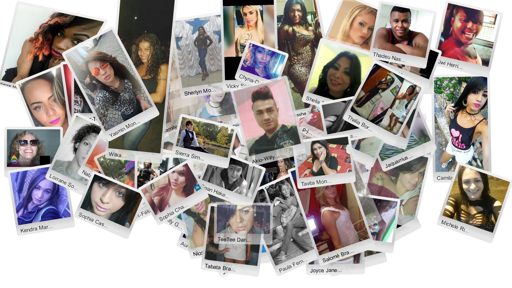

  The Bournemouth TDoR 2017 vigil.

I've done a lot of things since I came out in 2001, but volunteering to collate the data for the Trans Day of Remembrance vigil in Bournemouth (see **[Remembering Our Dead never gets any easier](/blog/2017/11/16/remembering-our-dead-never-gets-any-easier_580bd388)**) this year was definitely one of the hardest.

[@preview Remembering Our Dead never gets any easier](/blog/2017/11/16/remembering-our-dead-never-gets-any-easier_580bd388)

Between all of the tears (and there were *many*) one thing that struck me was that we didn't have a particularly good picture of just *who* we have lost — their lives were literally often reduced to just a few words on a page, and in many cases we don't even have a name.

With the official list collated by [Transgender Europe](https://tdor.tgeu.org/) not coming out until a few days before the event there also wasn't really time to find much more out. Worse, once we did have the official list the data available was quite sketchy or only partially translated from the original news reports, and there were no photos which can give us a feel for who they were.

Taken together this can make it hard to connect with the trans people we've lost, and *I think we owe it to them to do better, somehow*.

For the Bournemouth vigil we wanted to give people a way to connect directly with as many of the victims as we could. The idea (not one I can take credit for — it came from [Revd. Dwayne Morgan](https://www.inclusive.church/our-pastor/), the pastor of the Metropolitan Community Church of Bournemouth* ) was to print a laminated A4 sheet for each, and light a candle for them at the vigil. Getting all of that together takes time, so I volunteered to start collecting data a little earlier by browsing blogs and a handful of news sites.

* The Metropolitan Community Church of Bournemouth has since been renamed to [Inclusive Community Church](https://www.inclusive.church/).

  Preparing memorial cards for the Bournemouth TDoR 2017 vigil.

Just doing that unearthed a lot of information — including photos of many of those we had lost — which were duly entered into a spreadsheet. Once the official list arrived I tried to merge that in it into a form suitable for what we wanted to do for our vigil - a messy process which took several days of editing and reformatting.

While doing so I found that many of the descriptions in the official list didn't read particularly clearly (many were translated from news reports in various languages) so I ended up spending lots of time rewording them and cross-referring to the original news sources (Google Translate was helpful here) where those could be found.

It was grim work, and suffice it to say I now have a fairly good idea which search terms to use for the murders of trans people in various languages, and which sites to look at.

  For many victims we didn't have a photo, or even in many cases a name.

But three fraught days later it was done. By then we had discovered quite a bit of additional data (including over 100 photos and details of 9 victims who were not recorded in the official list), and started the process of editing, printing, laminating and collating…all 334 times over. It took a while, but eventually we got there.

  On the night of the vigil we laid out the memorial cards on the ground.

On the night of the vigil we laid out the pages in ten rows, grouped into five rows of two so that people could walk among them. As the names were read, candles were lit. It was *powerful*.

Maybe it was the fact that this year we had a P.A. system, or maybe it was all of the candles and the pages memorialising the victims — but a lot of passers-by stopped to look…to read…to cry...and even to pray.

What will I think be my most lasting memory of the evening is of a passer-by who was walking by when she heard us reading their names and how they had died. She came over, knelt down, crossed herself, read about some of the victims and prayed earnestly before walking away. It was such a simple gesture, but (to me at least) a beautiful one.

To her and the many cis (i.e. non-trans) folks who took part, **thank you for caring**. Many trans people have a really rough time, and knowing that others care enough to come along and make such a simple gesture really helps.

TDoR is now past us this year, but the killings never seem to stop so we'll be doing it all again next year. In the meantime, rather than let the everything we learnt about those we have lost in the past year fade into obscurity it seems appropriate to memorialise them all *somewhere* — and here is as good a place as any.

In the pages linked below I hope you'll learn a little about the trans people I know of who were killed between 1st October 2016 and 30th September 2017 (the 334 we commemorated on the night, plus those identified since).

Although we we know a little bit about some of them, sadly we know nothing about many — but I hope that others might be able to fill in some of those gaps in time.

I hope you'll be able to empathise with and understand them and the lives they tried to make the most of. Well over 100 of the entries have photos, and the *one thought I can't shake when I look at them is just how young most of them are*.

I can't promise is that reading what happened to them is likely to be an easy process — it certainly hasn't been for me.

Despite that, I'm glad I took the time to learn a little about them.

----

[TRIGGER WARNING: VIOLENCE. MURDER]

* [October 2016](https://tdor.translivesmatter.info/reports/2016/10) (28)
* [November 2016](https://tdor.translivesmatter.info/reports/2016/11) (25)
* [December 2016](https://tdor.translivesmatter.info/reports/2016/12) (19)
* [January 2017](https://tdor.translivesmatter.info/reports/2017/01) (29)
* [February 2017](https://tdor.translivesmatter.info/reports/2017/02) (35)
* [March 2017](https://tdor.translivesmatter.info/reports/2017/03) (25)
* [April 2017](https://tdor.translivesmatter.info/reports/2017/04) (32)
* [May 2017](https://tdor.translivesmatter.info/reports/2017/05) (30)
* [June 2017](https://tdor.translivesmatter.info/reports/2017/06) (30)
* [July 2017](https://tdor.translivesmatter.info/reports/2017/07) (33)
* [August 2017](https://tdor.translivesmatter.info/reports/2017/08) (30)
* [September 2017](https://tdor.translivesmatter.info/reports/2017/09) (33)

* **Total: [349](https://tdor.translivesmatter.info/reports/tdor2017)**

----

Note that in addition to the victims identified in the [TGEU TDoR 2017 list](https://tdor.tgeu.org), the pages linked above also contain details of:

* **Ahya Sapphire** (10 Oct 2016 in Caloocan, Philippines)

* **Raina Aliev** (31 Oct 2016 in Moscow, Russia)

* **Pamela Macedo Panduro** (1 Jan 2017 in Le Plata, Buenos Aires, Argentina)

* **Sean Hake** (6 Jan 2017 in Sharon, Pennsylvania, USA)

* **Symone Marie Jones** (12 Jan 2017 in Fayetteville, North Carolina, USA)

* **Gabriele Almeida** (8 Feb 2017 in Montes Claros, Minas Gerais, Brazil)

* **C. A. de Mendonça** (25 Feb 2017 in São João Nepomuceno, Minas Gerais, Brazil)

* **L. F. dos Santos** (12 Mar 2017 in Serra, Espírito Santo, Brazil)

* **Angie Velásquez Ramírez** (16 Mar 2017 in Le Plata, Buenos Aires, Argentina)

* **Danilo Melhorini** (15 Mar 2017 in São Paulo, Brazil)

* **Vulgo L. H. Santos** (18 Mar 2017 in Vitória, Espírito Santo, Brazil)

* **Name Unknown** (24 Mar 2017 in Porto Da Areia, Paraíba, Brazil)

* **Name Unknown** (28 Mar 2017 in Juiz de Fora, Minas Gerais, Brazil)

* **Sayra Hills** (3 Apr 2017 in São Paulo, Brazil)

* **Pinha Priscila** (17 Apr 2017 in Fortaleza, Brazil)

* **Imer Eliu Alvarado** (17 May 2017 in Fresno, Ohio, USA)

* **Leo Etherington** (31 May 2017 in High Wycombe, Buckinghamshire, United Kingdom)

* **Ezequiel Batista da Silva** (3 Jun 2017 in Alto Tietê, Brazil)

* **Sandra de Souza Medeiros** (25 Jun 2017 in São Carlos, Brazil)

* **M. Ferreira Avelino** (13 Jul 2017 in New Parnamirim, Brazil)

* **Akio Willy Costa Cruz** (18 Aug 2017 in Ananindeua, Brazil)

* **Pepper K aka Phoenix** (25 Aug 2017 in Mansfield, Ohio, USA)

* **Brandy Bardales Sangama** (10 Sep 2017 in Le Plata, Buenos Aires, Argentina)

* **Scout Schultz** (16 Sep 2017, Georgia, USA)

Dates of death have been corrected (using original news reports) for:

* **Bianca Bittencourt** (17 Oct 2016 not 31 Oct 2016)

* **Camila de Souza Magalhães** (23 Feb 2017 not 25 Feb 2017)

* **H. Ramirez Calderon** (19 Mar 2017 not 20 Mar 2017)

* **Paola Ponce** (19 Mar 2017 not 20 Mar 2017)

* **Sophie Castro** (29 Apr 2017 not 3 May 2017)

* **Juliana Orrego Monsalve** (30 Jun 2017 not 2 Jul 2017)

* **Gabrielle Sousa** (31 Jul 2017 not 21 Jul 2017)

In addition, names (e.g. “**Eyelen**” should be **Ayelén Gómez**) and narratives have been corrected and expanded upon using original sources where possible and the following unidentified victims identified:

* **C. A. Armas Carvajal** (11 Oct 2016 in Pénjamo, Guanajuato, Mexico)

* **C. do Nascimento Rolim** (13 Oct 2016 in São Paulo, Brazil)

* **A. Soto Mena** (“La Jana”) (29 Oct 2016 in Iguala, Guerrero, Mexico)

* **Kristina Trance** (19 Jan 2017 in Voronezh, Russia)

* **J. M. Sepriano** (13 Feb 2017 in the Naga, Philippines)

* **J.** (1 Mar 2017 in Municipio de Chalco, Mexico)

* **E. A. Moreira** (16 Apr 2017 in Itabuna, Brazil)

* **Gina Huerta Vallejo** (4 May 2017 in Apatzingán, Michoacán, Mexico)

* **Bruna** (10 Jun 2017 in Salvador, Brazil)

* **L. da Silva Santos** (16 Jun 2017 in Caraguatatuba, Brazil)

* **M. Ángel Vega Martínez** (4 Jul 2017 in Estado de Mexico, Mexico)

* **Monserrat Alejandra Carrizales Castro** (27 Jul 2017 in Nuevo Leon, Mexico)

* **R. S. Durán** (20 Aug 2017 in Cuautla, Morelos, Mexico)

If anyone has details to add, *please* let me know — I'll be happy to update the posts above with any additional details you can share.

No matter who they were, we mourn and miss every single one of them.

----

*Raw data for TDoR 2017 can be downloaded from [tdor.translivesmatter.info](https://tdor.translivesmatter.info/reports/tdor2017?country=all&filter=).*

----

  Just some of the trans people lost to violence during the period covered by TDoR 2017.

**A final thought:** while compiling all of this information, it struck me that a blog site like Medium really wasn't the ideal way to present individual biographies, and that a dedicated database driven site where contributors could upload/edit individual entries independently would probably work much better.*

**Update: A site for this purpose](https://tdor.translivesmatter.info) has now been developed:**

[@preview tdor.translivesmatter.info](https://tdor.translivesmatter.info)

If you wish to contribute to this effort please let me know.

----

*Follow-up blogpost:*

[@preview TDoR 2018: Say their names. Learn their stories. Remember them](/blog/2018/12/24/tdor-2018-say-their-names-read-their-stories-remember-them_0da1b178)

----

***About The Author***

*[Anna-Jayne Metcalfe](https://www.annasplace.me.uk/about) is a software engineer who volunteers to help research, collate and share data on violence against trans people. This blogpost was originally published by Anna on [Medium](https://annajayne.medium.com/tdor-2017-say-their-names-learn-their-stories-remember-them-b81d50fd8ef).*
