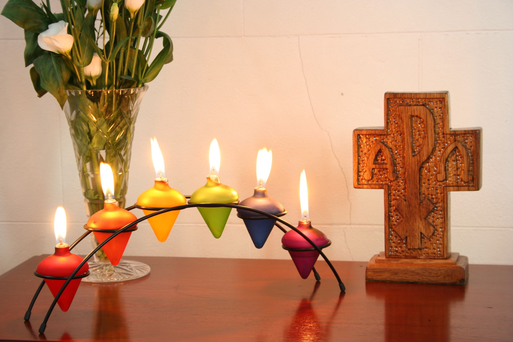
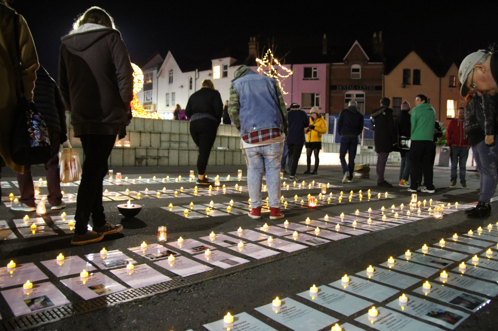

[TRIGGER WARNING: pain, violence and murder]

  Rainbow candles in the prayer chapel of my church in Bournemouth.

There are times when I wonder how I ended up doing what I do, and what makes me carry on doing it.

Collating information on violence against trans people in preparation for **[Transgender Day of Remembrance](https://en.wikipedia.org/wiki/Transgender_Day_of_Remembrance)** (TDoR) events held every November is like that.

I'm not joking when I say that the cavalcade of horror that has passed through my browser since I started doing this last November has been quite unrelenting. It's rare that more than a couple of days passes without me seeing a photo of something ghastly, and every so often something I see pulls me up short and the sheer horror of it all really hits home. Tears inevitably follow.

While doing this I know I have to be careful to pace myself as I know it could all too easily consume me (**[I had a taste of that last year](/blog/2017/11/16/remembering-our-dead-never-gets-any-easier_580bd388)** while preparing for the Bournemouth TDoR event. It wasn't fun).

But despite all of the horror, *it feels worth it* because it's helping me (and hopefully others) to better understand what some other trans people face, and the lives they are forced by circumstances to lead. By reading about what's happening to other trans people around the world (and in particular reading outside the anglocentric bubble I know I live in) I have also learnt more about the intersection of poverty and marginalisation than I care to admit. It's a very sobering experience.

Of course it also helps those taking part in TDoR events to connect with everyone we've lost - which is really the point.

  The Bournemouth TDoR 2017 vigil.

For me, the potential impact of this was illustrated perfectly by the reaction of one passerby at last year's TDoR event here in Bournemouth. She wasn't taking part in the event, but was walking by while we were reading the names of the victims and how they had died.

When she saw us all gathered and heard us reading she came over, knelt down, crossed herself, read some of the cards naming the victims and how they had died and then prayed earnestly before walking away.

It was such a simple gesture, but (to me at least) a beautiful and heartfelt one. I have no idea who she was, but I am grateful to her for sharing in our grief.

But back to those we have lost.

I *know* I can't ever fully comprehend the lives they led or how they suffered.

I know I'm fortunate and privileged. I'm white, "passable" (whatever that means), financially independent and live in a place which feels (to me at least) safe and secure. I have never been a sex worker, slept on the street, lived in fear of gun or gang violence or been a drug user. For all it's (many) faults, I even live in a country where even most trans healthcare procedures are free.

Make no mistake - **I'm very privileged**.

I know that most trans people don't have all of my advantages, and that among them are the far too many we mourn.

So I carry on regardless - but this **[February has been quite brutal](https://annajayne.medium.com/remembering-our-dead-february-2018-54c49cf4d48d)**. I'm glad it's over.

One more thing.If you want to help this effort, please join the **[Trans Violence News](https://www.facebook.com/groups/1570448163283501/)** group on Facebook and post any keep an eye out for reports of violence against trans people in the media or elseware.

The more we can share out the horror, the easier it becomes on all of us.

----

***About The Author***

*[Anna-Jayne Metcalfe](https://www.annasplace.me.uk/about) is a software engineer who volunteers to help research, collate and share data on violence against trans people. This blogpost was originally published by Anna on [Medium](https://annajayne.medium.com/some-months-are-harder-than-others-ab1575f17606).*
