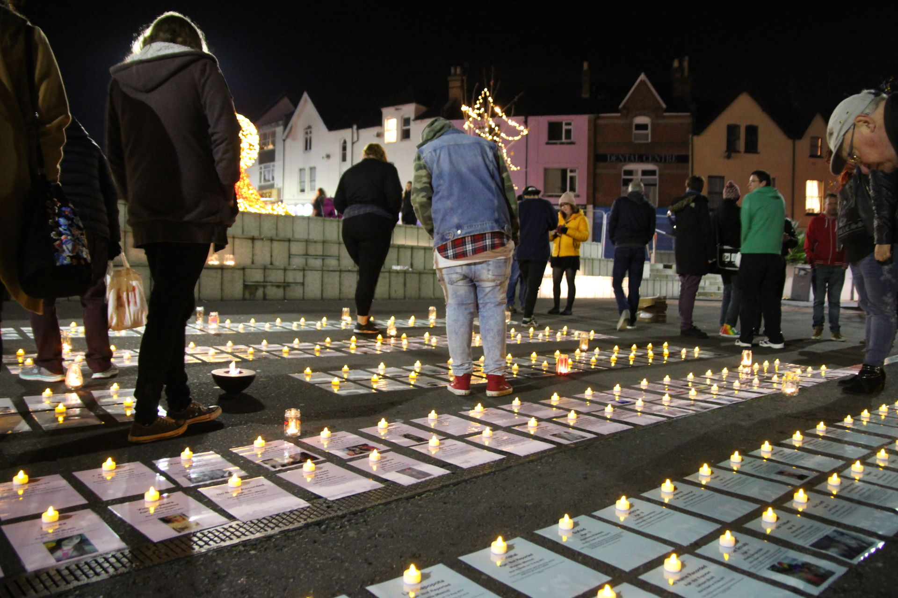
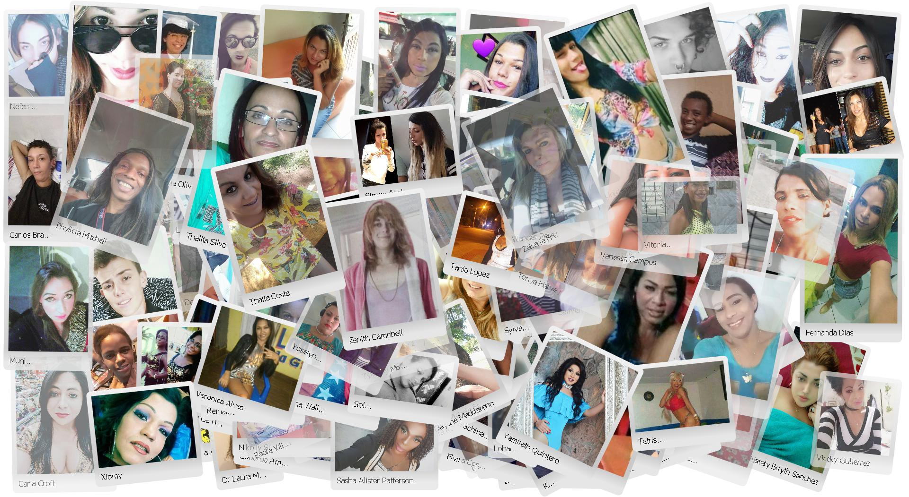

*Introducing __[tdor.translivesmatter.info](https://tdor..translivesmatter.info)__ — a new website to provide supporting information and resources for TDoR events.*

  At the Bournemouth TDoR vigil in November 2017, memorial cards helped people to connect with those we had lost.

**[TRIGGER WARNING: transphobia, violence, suicide and murder]**

In October 2017 three LGBT+ groups on Bournemouth got together to plan the local Transgender Day of Remembrance vigil the following month.

As most of us will know, a TDoR vigil is usually a simple event where we **[read the names of our dead and remember what happened to them](https://www.youtube.com/watch?v=8WuvCfCpU9Y)** *[[guidance](https://transgenderdordotcom.files.wordpress.com/2014/10/tdortips.pdf)].*

Often, all we know for certain about the victims is how little we know. The official TDoR memorial list released by **[Transgender Europe](https://tdor.tgeu.org/)** (TGEU) in early November doesn't tend to tell us a great deal about each of them:

* Often (but not always) a name

* Sometimes their age (and all too often they were often so very young)

* How and where they died

* A (very) brief narrative describing what happened to them, often maddeningly incomplete.

* A little information about the source of the report (though usually not a link where we could learn more)

And that's it — a whole life extinguished, with barely a few lines of text to tell their story. As each is only one among so very many lost lives the need for brevity is understandable — but I can't help thinking that it doesn't help us to connect with them.

----

### Learning A Little More

By and large the information disseminated about each victim hasn't really changed since TDoR started at the end of the last century. However today we have far more advanced tools at our disposal (for example search engines, translation tools and of course social media) which can allow us to learn more about them if we a) have the time and b) can cope with all of the horror doing so inevitably involves.

Many activists all around the world are already doing just that of course — each doing their bit to shine a light on to the horror, raise awareness and advocate for change. It doesn't matter whether they are protesting, educating or just lighting a candle — what's important is that among us there are those who feel able to and driven to do something.

Among them are those working to raise awareness of the murders and suicides of individual trans people. I know from my own experience of the past year that that is a traumatic, distressing task and it's not one I'd wish on anyone.

However, the result of that is that when a trans person is murdered in many countries there's a reasonable chance that an activist somewhere will find the original news report and search for corroborating information. The same can be true of deaths by suicide, although with the exception of high profile cases like that of [Ekai Lersundi](https://elpais.com/ccaa/2018/02/16/paisvasco/1518789270_034784.html) they tend to be far less well reported.

Often it is possible to find out a little bit more about what happened from news reports or social media posts. Sometimes it is just their name or age (if those were not reported by TGEU), sometimes it's a quote from a friend or family member — and occasionally it's something far more personal — like **[something they have written](https://www.cadaminuto.com.br/noticia/314015/2017/12/18/segundo-a-medicina-e-a-sociedade-nasci-menino-porem-nunca-me-identifiquei-como-tal)** *[Kyara Barbosa; 4 Dec 2017]*, **[a blogpost or article about them](https://www.telesurtv.net/english/news/The-Murder-of-Brandi-Bledsoe-the-23rd-Trans-Woman-Killed-in-2016-20161027-0010.html)** *[Brandi Bledsoe; 8 Oct 2016]*, or even **[a video of them doing what they loved](https://www.facebook.com/sk3media/videos/867809473385590/)** *[Maritza Harrera; 25 May 2018]*.

Every piece of information tells a story, and I think we owe it to them to try to make at least some of that part of TDoR, somehow.

----

### The 2017 Vigil

It wasn't the first time we had held a vigil in Bournemouth — in previous years, volunteers had read from the list of names and lit candles for them in much the same way as (I imagine) most TDoR vigils all around the world.

It was, as always, horrible and sorrowful but full of the resolve of all present to try to change things.

But this time a new idea was put forward — to create a laminated memorial card for each of the victims — all 325 of them.

I described what happened next in the blogpost **[Remembering Our Dead never gets any easier](/blog/2017/11/16/remembering-our-dead-never-gets-any-easier_580bd388)**.

[@preview Remembering Our Dead never gets any easier](/blog/2017/11/16/remembering-our-dead-never-gets-any-easier_580bd388)

> One of the things we wanted to do for the vigil was print a laminated sheet in the colours of the trans flag for each victim so that attendees could light a candle for them. I volunteered to collate the data from TGEU [Transgender Europe] and convert it into a form (a spreadsheet, basically) we could use to generate the materials we need, and it struck me that if we were able to add photos for at least some of them it would help everyone to visualise those we mourn.
>
> **I honestly didn't know what I was letting myself in for.** I started by searching [PinkNews](https://www.pinknews.co.uk/), as they routinely report on the killings of trans people in the UK and USA, and occasionally also from elsewhere in the world. It didn't take long to find an article which listed every victim in the USA, and that gave me enough information to find appropriate photos for almost all of them.

Suffice it to say that it was a traumatic experience. Reading murder reports (particularly those from Latin America, which can be much more graphic than we are used to in the UK) is definitely not easy, and by the end of it all I was numb and badly needed needed to talk through what I'd learnt with friends (which needless to say, wasn't something they were ready for either).

But no matter how traumatic an experience I found reading reports of all of the horror, it was worth it for the way it helped everyone who came to the vigil to so obviously relate to those we'd lost. It didn't matter that most of them lived lives so different to our own — having just a little bit more information about them helped us to empathise more closely with them.

After the vigil was over I wrote up what happened and what I'd learnt in a series of blogposts starting at **[TDoR 2017: Say their names. Learn their stories. Remember them](https://medium.com/@annajayne/tdor-2017-say-their-names-learn-their-stories-remember-them-b81d50fd8ef)**. There was one blogpost for each month, and a summary one which indexes them all together.

[@preview TDoR 2017: Say their names. Learn their stories. Remember them](/blog/2017/11/24/tdor-2017-say-their-names-read-their-stories-remember-them_94cc5399)

----

### Preparing for TDoR 2018

The impact the memorial cards had at the TDoR 2017 vigil helped me to conclude that if I could I should try to keep collating details of those we had lost — but I knew I had to find a way to do so that was less damaging to my own mental wellbeing. Fortunately, I've found that keeping track of reports as they come in during the year is easier to cope with than trying to do it all in an intensive set of research just before the TDoR vigil.

So that is exactly what I — and many others worldwide — have been doing over the past few months. We use Facebook groups such as **[Trans Violence News](https://www.facebook.com/groups/1570448163283501/)** and **[Transgender Violence](https://www.facebook.com/groups/TransViolence/)** to share details of news reports and other news sources, and work together to discover appropriate details that would otherwise remain hidden.

As a result of this work **we already know about most of those who we will be remembering at TDoR vigils in November 2018**, and in fact there is already a draft blogpost covering TDoR 2018 at **[TDoR 2018: Say their names. Read their stories. Remember them](/blog/2018/12/24/tdor-2018-say-their-names-read-their-stories-remember-them_0da1b178)**.

Like the corresponding blogposts for TDoR 2017, the stories they reveal are heartbreaking and make **very** sobering reading.

[@preview TDoR 2018: Say their names. Read their stories. Remember them](/blog/2018/12/24/tdor-2018-say-their-names-read-their-stories-remember-them_0da1b178)

----

### What should we do with this information?

Even at the time I wrote the TDoR 2017 blogposts it was already obvious that the blogpost format was not at all ideal for presenting this sort of information, and ideally we needed something better. At the end I wrote this:

> **A final thought:** in compiling all of this information, it struck me that a blog site like Medium really wasn't the ideal way to present individual biographies, and that a dedicated database driven site where contributors could upload/edit individual entries independently would probably work much better.
> If others wish to collaborate on such an effort, let me know.

Hence for the past few months I've been working on a dedicated database driven website to present this information.

In June I took a prototype to the **[Trans*Code](https://twitter.com/trans_code)** hackathon staged as part of the PyLondinium 2018 conference to gather feedback and share ideas. The folks at the hackathon came up with lots of ideas and added a popup content warning to the site (something I'd not thought of, but which is definitely needed).

Since then I have been working through some of those ideas and turning them into reality. As a result a̶n̶ ̶i̶n̶i̶t̶i̶a̶l̶ ̶v̶e̶r̶s̶i̶o̶n̶ ̶o̶̶f the site is now available at **[https://tdor.translivesmatter.info](https://tdor.translivesmatter.info)**.

[@preview tdor.translivesmatter.info](https://tdor.translivesmatter.info)

̶A̶l̶t̶h̶o̶u̶g̶h̶ ̶o̶n̶l̶y̶ ̶d̶a̶t̶a̶ ̶f̶o̶r̶ ̶T̶D̶o̶R̶ ̶2̶0̶1̶8̶ ̶a̶n̶d̶ ̶2̶0̶1̶7̶ ̶i̶s̶ ̶i̶n̶c̶l̶u̶d̶e̶d̶ ̶s̶o̶ ̶f̶a̶r̶,̶ ̶t̶h̶a̶t̶ ̶f̶o̶r̶ ̶p̶r̶e̶v̶i̶o̶u̶s̶ ̶y̶e̶a̶r̶s̶ ̶w̶i̶l̶l̶ ̶b̶e̶ ̶a̶d̶d̶e̶d̶ ̶e̶v̶e̶n̶t̶u̶a̶l̶l̶y̶ ̶a̶s̶ ̶t̶i̶m̶e̶ ̶p̶e̶r̶m̶i̶t̶s̶. At the moment the site is read-only and does not provide a way for others to contribute, but that should also change in due course.

***Update:** Data is now available going back to March 1970, and as and when other reports come to light they'll be added.*

However the site already provides a basic memorial slideshow facility which may well be suitable for a background display at a TDoR event, and you can selectively download all of the data (in CSV form suitable for opening in a spreadsheet) and photos for the displayed reports if you need to.

A companion Twitter account (**[@tdorinfo](https://twitter.com/tdorinfo)**) has also been set up:

[@preview(url="https://twitter.com/tdorinfo" title="TransLivesMatter - @TDoRInfo" image-url="https://tdor.translivesmatter.info/images/tdor_candle_jars.jpg" description="Account commemorating #trans people lost to violence and suicide. DMs open. TRIGGER WARNING - distressing content.") @tdorinfo](https://twitter.com/tdorinfo)

----

### Coming Sooner or Later

What we have so far is a start, but obviously there is scope to do a great deal more if needed. The sort of things I can see being potentially useful include:

* Direct editing of reports (*since implemented*)

* A way for people to submit links, reports or corrections (*since implemented*)

* Downloading and printing of memorial cards (like the ones shown in the photo at the beginning of this article) for TDoR vigils (*since implemented)*

* RSS feeds (*since implemented*)

* Translations to other languages

What we have already is a start, however.

----

### Technical Stuff

For the technically minded, the site is running on a hosted CPanel Linux server which comes with PHP and MySQL. Scripts are written as a mixture of Python and Windows batch files (though I'm open to changing the latter to a cross-platform alternative).

Repositories for the project are available on B̶i̶t̶b̶u̶c̶k̶e̶t̶  GitHub at:

* **[https://github.com/annajayne/tdor-site](https://github.com/annajayne/tdor-site)** (code)

* **[https://github.com/annajayne/tdor-data](https://github.com/annajayne/tdor-data)** (data) and

* **[https://github.com/annajayne/tdor-research](https://github.com/annajayne/tdor-research)** (ongoing research)

Maintaining a site like this (and especially the data behind it) is an intensive, psychologically demanding process, so how it develops will obviously depend on the volunteers who are willing and able to work together on such a grim project.

Any help with the project (whether on a technical, research, data collation or social media capacity) would be most welcome. If you want to help out or offer feedback, please let me know.

----

### Risks

I am very aware that there is a degree of risk associated with doing this. In particular, there are people out there who wish us ill, and will have no qualms about trying to weaponise information about the deaths of trans people against us all.

That said, our lives can be just as broken and messy as the rest of the population. As such the fact that some trans murder victims [were killed by other trans people](https://brasiliadefato.com.br/grandebrasilia/2018/05/policia-busca-ultima-foragida-de-assassinato-de-travesti-em-taguatinga/) isn't something we should shy away from or pretend does not happen.

Equally, site security is something we must take seriously and there is a conversation to be had about what data we *should* (as opposed to *could*) share about victims — especially given the amoral tactics of some transphobes out there.

However, it is worth being clear that all information shared to date has been taken from publicly accessible sources (mostly news reports and public social media posts). Some links quoted are to Closed social media groups, but (obviously) none are to or sourced via Secret groups.

----

### Lest We Forget

But we must never forget that all of these details are just a means to an end.

TDoR 2018 is still over two months away, and even browsing through the reports that we already have is absolutely heartbreaking — but if we can, we owe it to them to do at least that.

  Just some of the far too many trans people we have lost to violence in the past year.

Finally, I would be remiss if I didn't say thank you to all of the activists worldwide who are working tirelessly to shine a light on all of the violence and try to make sure that those we have lost are not forgotten. You're all amazing.

I'm an optimist, so I'm convinced that one day the endless trail of horror will finally end — but even when it does, I hope that we will all feel that we should keep remembering those we will have lost on the way there.

I think we owe them that, at least.

----

***About The Author***

*[Anna-Jayne Metcalfe](https://www.annasplace.me.uk/about) is a software engineer who volunteers to help research, collate and share data on violence against trans people. This blogpost was originally published by Anna on [Medium](https://annajayne.medium.com/tdor-learning-more-about-those-we-have-lost-8043146f402c).*
