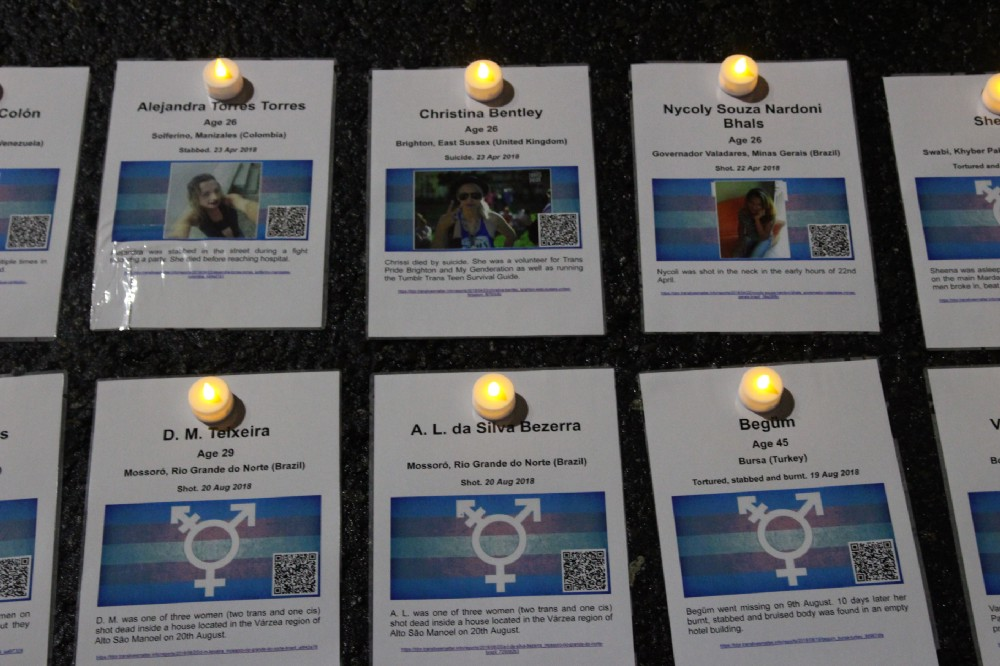

  At the TDoR 2018 vigil in Bournemouth we used memorial cards to help everyone visualise those we were remembering.

This is a short speech I gave at the Transgender Day of Remembrance (TDoR) vigil held in Bournemouth, UK on Tuesday 20th November 2018.

I thought I would reproduce here in case anyone else finds it useful in future.

> This is a traumatic time of year for trans people, so thank you all for coming — I know how hard this is. If you are not trans yourself, thank you for coming along to support us.
>
> Every year the Trans Murder Monitoring Project produces a report which lists all of the trans people they know of who have lost their lives to violence in the past year.
>
> Every year the numbers go up. Last year they reported 325 names, but this year it is 368.
>
> But still far too many reports go unnoticed. To support last year’s vigil we started doing our own research.
>
> The end results were memorial cards for each victim like those you see here today — and the realisation that we were finding reports of victims who were missing from the official list.
>
> I have to tell you that as of today, we know of 419 victims.
>
> The data on the official list nominally only includes murder victims — however we lose people for lots of reasons — murder, suicide, medical neglect, organisational indifference, homelessness and so on.
>
> Some of the cases we know of reflect that. Some were deaths in custody, or cases where medical treatment had been withheld by the authorities. Some were a result of unsafe medical procedures which they felt they had to undergo to function in society.
>
> And every life lost is a tragedy.
>
> The memorial cards in front of you give you a little information on each of them. In many cases we know very little, but in some cases we know enough to paint a picture of who they were.
>
> On each card there is a QR code. If you scan that it will take you to a page which tells you what we know about them.
>
> On those pages you can find things they’d written, quotes from friends and family members, poetry and even in one case a video of of one of them having a great time dancing behind her DJ decks at a Mexican TV station.
>
> They were poets, musicians, dancers, doctors, clerks and so much more. Many were sex workers of necessity, but that shouldn’t be how we define them.
>
> Please be aware that each page may link to news sites containing disturbing imagery. We recommend not following source links unless you feel strong enough to do so.
>
> But we hope that this year you will take a moment to learn a little about the people we have lost.
>
> Most of them were so young, and we mourn all of them.
>
> This year there were several victims in the UK. One — **[Naomi Hersi](https://tdor.translivesmatter.info/reports/2018/03/18/naomi-hersi_hounslow-greater-london-united-kingdom_b3938714)** — was stabbed in Hounslow in March, and her killer is now serving a life sentence.
>
> The others we know of were suicide victims — [two of whom were students](https://tdor.translivesmatter.info/reports/2018/03/17/jacob-whelan_cardiff-wales-united-kingdom_3097f77d) [at the same university](https://tdor.translivesmatter.info/reports/2018/05/30/marty-dragonova_cardiff-wales-united-kingdom_37d2b9b3), [one a volunteer with Trans Pride Brighton](https://tdor.translivesmatter.info/reports/2018/04/23/christina-bentley_brighton-east-sussex-united-kingdom_f8763c8c), and [one a child](https://tdor.translivesmatter.info/reports/2018/09/22/name-unknown_united-kingdom_02351c73).
>
> We know there were many more suicide victims we don’t know about.
>
> Today is heartbreaking, but I think it’s important.
>
> The Trans Day of Remembrance has a motto: **“Remember Our Dead. Fight Like Hell for the Living”**.
>
> So I hope that today’s events will strengthen us, and leave us more and more resolved to carry on that fight.
>
> Thank you.

----

***Footnote***: The memorial cards we used (all 419 of them, each individually printed and laminated) were produced using the website at **[https://tdor.translivesmatter.info](https://tdor.translivesmatter.info)**.

[@preview https://tdor.translivesmatter.info](https://tdor.translivesmatter.info)

I wrote about the website and the data behind it not that long ago in the blogpost **[TDoR: Learning more about those we have lost](/blog/2018/09/07/tdor-learning-more-about-those-we-have-lost_c3e16fa9)**:

[@preview TDoR: Learning more about those we have lost](/blog/2018/09/07/tdor-learning-more-about-those-we-have-lost_c3e16fa9)

----

***About The Author***

*[Anna-Jayne Metcalfe](https://www.annasplace.me.uk/about) is a software engineer who volunteers to help research, collate and share data on violence against trans people. This blogpost was originally published by Anna on [Medium](https://annajayne.medium.com/a-short-speech-from-a-transgender-day-of-remembrance-vigil-a51b96e7972d).*
