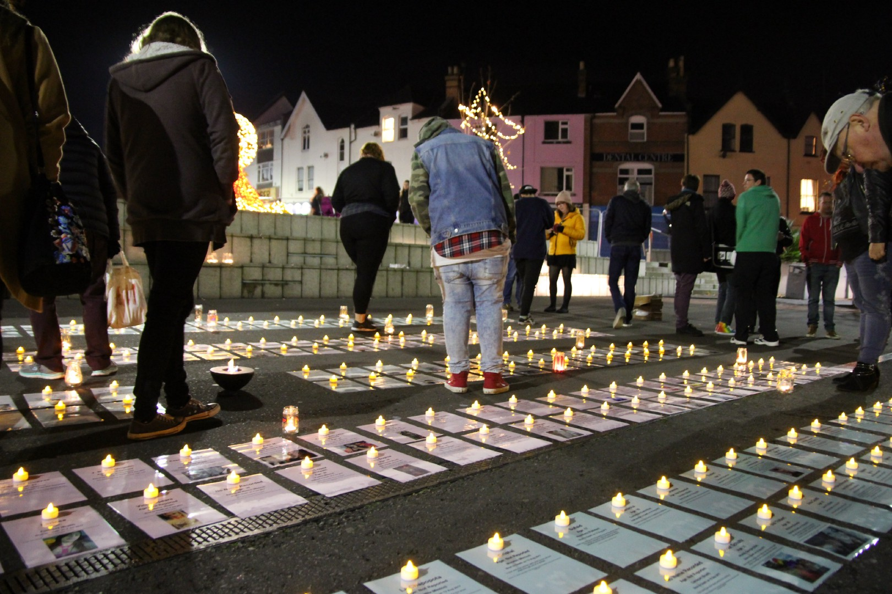
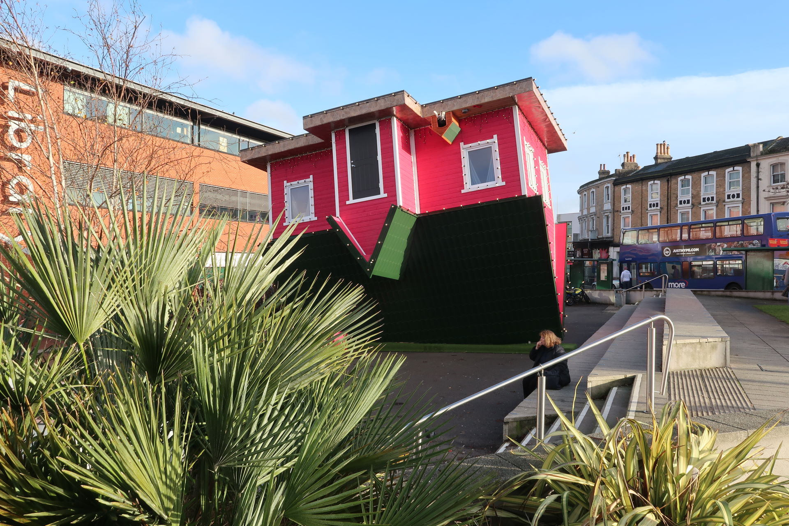
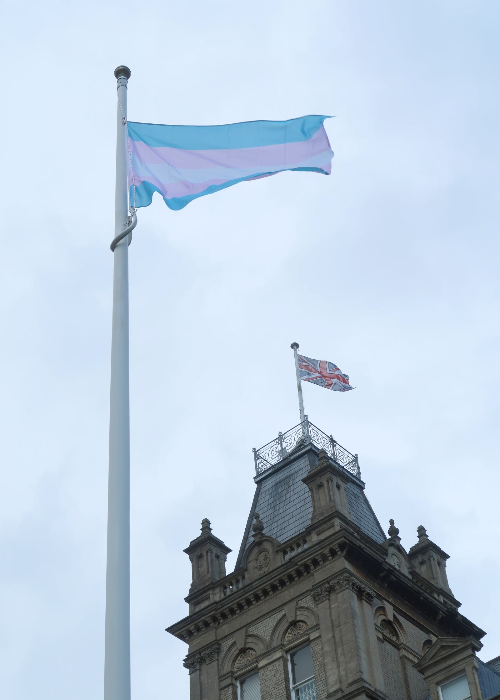
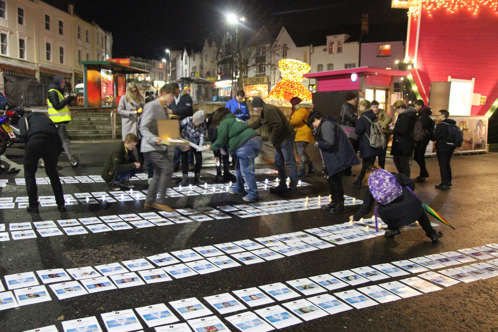
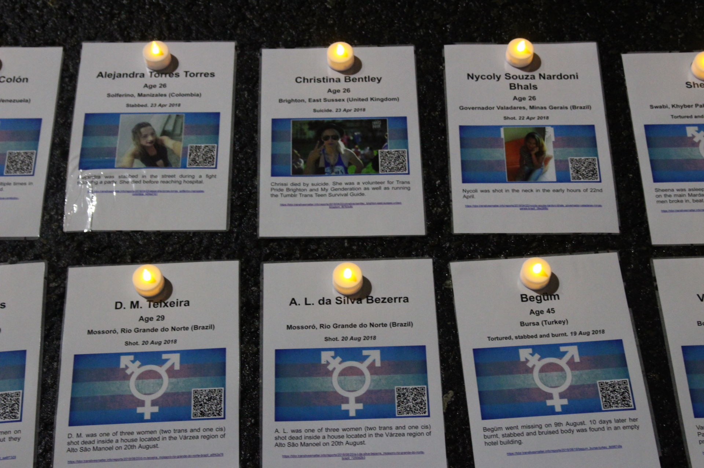
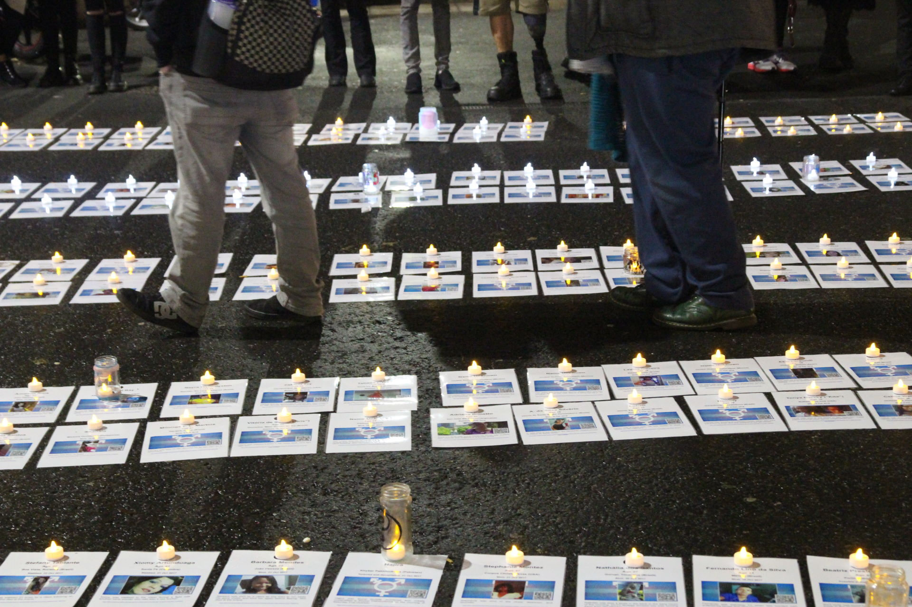
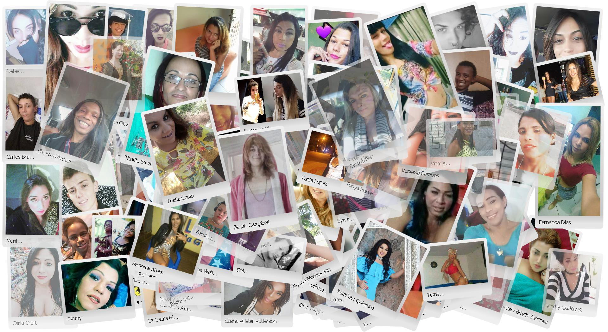

  The Bournemouth TDoR 2017 vigil [photo: [Anna-Jayne Metcalfe](https://www.annasplace.me.uk/about)]

At the end of October 2017 a group of us started preparing for the Transgender Day of Remembrance (TDoR) 2017 vigil in my home town of Bournemouth, and I volunteered to collate data on those we had lost.

[Aside from the vigil itself](/blog/2017/11/24/tdor-2017-say-their-names-read-their-stories-remember-them_94cc5399), the end results were blog posts, many tears and a *lot* of painstakingly collected data which we used to produce a memorial card for every victim we knew about.

[@preview TDoR 2017: Say their names. Learn their stories. Remember them](/blog/2017/11/24/tdor-2017-say-their-names-read-their-stories-remember-them_94cc5399)

There was of course a cost — collating the data we needed for the vigil was an incredibly time consuming and emotionally intense experience which took quite a toll on me. I wrote about what happened in the blogpost **[Remembering Our Dead never gets any easier](/blog/2017/11/16/remembering-our-dead-never-gets-any-easier_580bd388)**.

[@preview Remembering Our Dead never gets any easier](/blog/2017/11/16/remembering-our-dead-never-gets-any-easier_580bd388)

Nevertheless, it was the right thing to do and I don't regret it one bit. That said, for my own sanity I decided to approach the process for TDoR 2018 differently and collect data *throughout the year*.

That is actually not as difficult as it sounds as the majority of the deaths reported originate in a single country (Brazil) with a well established trans murder monitoring programme by organisations like **[RedeTransBrasil](http://redetransbrasil.org.br/)** and **[Grupo Gay da Bahia](https://homofobiamata.wordpress.com/)**. Many others are either in the USA (which is well covered by the English speaking LGBT press) or countries in Latin America which share a common language (Spanish). In Europe, Turkey and Italy seem to be the countries in which trans people are most likely to be killed.

However it should be said that in many countries (e.g. most of Africa, the Middle East, Eastern Europe and much of Asia) violence against trans people is often not reported as such and therefore it is much harder to learn much about anti-trans violence there. Similarly, languages with non-Roman character sets (e.g. Japanese, Mandarin, Cantonese, Thai, Malay and Korean) pose their own difficulties.

However — assuming they *are* reported — once you know the search terms to look for (e.g. “trans/travesti/transgenero/transexual muerte/muerto” for Spanish language countries) it is often relatively easy (albeit very time consuming) to find most of the corresponding news reports — at least in countries where the deaths of trans people are actually reported as such.

It also helps that I'm far from the only one tracking down such reports. For example, there are **[Transgender Violence](https://www.facebook.com/groups/TransViolence/)** and **[Trans Violence News](https://www.facebook.com/groups/1570448163283501/)** Facebook groups which activists use to share and distribute details of relevant news and social media reports. As a result this year I've been able to focus my efforts more towards writing up what we've found and making people more aware of what's going on in the world.

----

Back when I was compiling TDoR data for last year, it struck me that a blog site like Medium really wasn't the ideal way to present individual biographies, and that a dedicated database driven site where contributors could upload/edit individual entries independently would probably work much better.

Since last year **[a site for this purpose](https://tdor.translivesmatter.info)** is being developed and is now being used to host the detailed reports linked to below (as an aside, if you wish to contribute to this effort please let me know).

[@preview tdor.translivesmatter.info](https://tdor.translivesmatter.info/)

Please see the blogpost **[TDoR: Learning more about those we have lost](/blog/2018/09/07/tdor-learning-more-about-those-we-have-lost_c3e16fa9)** for details.

[@preview TDoR: Learning More About Those We Have Lost](/blog/2018/09/07/tdor-learning-more-about-those-we-have-lost_c3e16fa9)

----

Sadly this year the horror just kept coming, with February and March 2018 being particularly brutal months. Almost every morning at least one new report turned up in the search results, and keeping up with them was both traumatic and hard.

Inevitably some reports hit harder than others. Quite honestly the sight of the (blurred, thankfully) photo of the bloodied body of **[Gabriely Fancciny](https://tdor.translivesmatter.info/reports/2018/04/28/gabriely-fancciny_porto-velho-rondonia_brazil_a76e39db)** which the Brazilian media included in their news reports of her murder still gives me nightmares.

  [Gabriely Fancciny](https://tdor.translivesmatter.info/reports/2018/04/28/gabriely-fancciny_porto-velho-rondonia_brazil_a76e39db) was murdered in Porto Velho on 28th April 2018.

But there were positive things to hold on too, too. I read the words of **[Kyara Barbosa](https://tdor.translivesmatter.info/reports/2017/12/04/kyara-barbosa_morada-nova_brazil_54739824)**, watched a video of **[Maritza Harrera](https://tdor.translivesmatter.info/reports/2018/05/25/maritza-harrera_igualala-guerrero_mexico_7a53e209)** dancing behind her decks while DJing at a Mexican TV station and more. It feels like a privilege to be able to see those little glimpses — and a reminder that every time we lose someone, we lose so, so much.

Closer to home, the last tweet of **[Naomi Hersi](https://tdor.translivesmatter.info/reports/2018/03/18/naomi-hersi_hounslow-greater-london_united-kingdom_b3938714)** — the only UK murder victim this year — was about [violence towards trans women of colour](https://twitter.com/naomi_hersi/status/603366252883632128), and her murder didn't get half the attention you might have expected. I can't help wondering how much of that was due to the fact that she was a black trans woman herself.

  [Naomi Hersi](https://tdor.translivesmatter.info/reports/2018/03/18/naomi-hersi_hounslow-greater-london_united-kingdom_b3938714) was murdered in Greater London on 18th March 2018.

The official Transgender Europe (TGEU) TDoR list of names doesn't generally include suicide victims, so the handful we knew of in the UK (a tip of a very large iceberg, we think) weren't included on it.

One of them — **[Chrissi Bentley](https://tdor.translivesmatter.info/reports/2018/04/23/christina-bentley_brighton-east-sussex_united-kingdom_f8763c8c)** — was on the edge of my social circle and I may well have met her at Trans Pride Brighton (I honestly can't remember, and I feel guilty for that).

  [Chrissi Bentley](https://tdor.translivesmatter.info/reports/2018/04/23/christina-bentley_brighton-east-sussex_united-kingdom_f8763c8c)

It never gets any easier, but when it's so close to home it is especially hard.

----

A few weeks before the Bournemouth vigil (and with the period covered by TDoR 2018 over), local groups once again met in Bournemouth to plan our vigil.

The intention was to run the event similarly to last year, and in the same space in Bournemouth Triangle. By the time the planning meeting took place we knew of 353 victims (most victims of direct violence, but the data we had also included 31 suicides, 4 deaths in custody and 7 victims of clinical neglect).

That was bad enough, but when the official TGEU list of 368 victims was released and we merged the two sets of data the combined list included a horrific 419 victims.

A memorial card was printed and laminated for each victim using the corresponding option on [**tdor.translivesmatter.info**.](https://tdor.translivesmatter.info.)

But then — two weeks before the event — we were blindsided by the area we planned to use being fenced off, with a large HGV parked right where we planned to hold the event. Once the dust had settled, this commercial monstrosity appeared:

  The "tourist attraction" which appeared in the space we were planning to use for the vigil.

I don't mind admitting that I lost it at this point.

> “How could the council do this? Do they honestly not know that trans folks use this space to mourn our dead every November? **Have they no respect?**”

It took me a while to calm down. The short answer is that no, they didn't know (although if the organisation had managed to actually be representative of the community they serve, I can't see how that could have happened), and once again I owe the Pastor of our church — Revd. Dwayne Morgan — my heartfelt thanks for sorting it out, and for making sure that the event was firmly in the council calendar.

Once the Council were onboard, they didn't (as they had in 2017, when we enquired with them when planning the vigil) try to charge us for the privilege of mourning our dead. They did however hoist our flag for two days, on 20th and 21st November, and that is a definite first for Bournemouth!

  The Trans Flag flying outside Bournemouth Town Hall for the Transgender Day of Remembrance

I hope that next year we won't have to contend with the same challenges, but obviously you can never rule out these sorts of things popping up at the last minute.

----

The vigil itself ran smoothly (other than the power dying two thirds of the way through after a cable got sliced). It was a squeeze, but somehow we found space to one side of the upside down house for both the crowd and all 419 memorial cards.

After we had set everything up we said our introductions. I gave a short speech as part of the introduction, which you can read in the blogpost **[A short speech from a Transgender Day of Remembrance vigil](/blog/2018/11/30/a-short-speech-from-a-transgender-day-of-remembrance-vigil_86b15fec)**.

[@preview A short speech from a Transgender Day of Remembrance vigil](/blog/2018/11/30/a-short-speech-from-a-transgender-day-of-remembrance-vigil_86b15fec)

Over three freezing hours all 419 names we knew of were read, candles were placed and we all paid our respects.

  Volunteers place candles during the Bournemouth TDoR 2018 vigil

Each memorial card had a QR code which when scanned would open a page relating to that report, with an appropriate trigger warning issued at the beginning for the distressing content they obviously contain.

  Memorial cards during the TDoR 2018 vigil in Bournemouth

  Mourners walk amongst the memorial cards during the TDoR 2018 vigil in Bournemouth.

So that's it for another year.

I'm afraid that the killings keep happening, and even as we were planning the TDoR 2018 event we already knew of the first of those we will be commemorating at next year's event: names such as **[Juliana Ferreira](https://tdor.translivesmatter.info/reports/2018/10/02/juliana-ferreira_mandaguacu-parana-brazil_090263aa)**, **[Laysa Fortuna](https://tdor.translivesmatter.info/reports/2018/10/19/laysa-fortuna_aracaju-sergipe-brazil_58ba85f2)**, **[Ciara Minaj Carter Frazier](https://tdor.translivesmatter.info/reports/2018/10/03/ciara-minaj-carter-frazier_chicago-illinois-usa_50ed57cb)**, **[Brenda Zarik Sifuentes Andrade](https://tdor.translivesmatter.info/reports/2018/11/04/brenda-zarik-sifuentes-andrade_la-esperanza-district-trujillo-la-libertad-peru_92a650b3)** and **[Tydi Dansbury](https://tdor.translivesmatter.info/reports/2018/11/26/tydi-dansbury_baltimore-maryland-usa_07def7d3)**.

Just when will it all end?

----

In the pages linked below you will find details of **trans people I know to have died by violence, suicide or as a result of related causes during the period 1st October 2017 to 30th September 2018**.

I've also included details of a handful of those lost to suicide or unlicenced surgical procedures, although as most cases are not reported (*or not reported as being deaths of trans people*), very few cases are listed here by comparison with the number killed directly by others.

Needless to say I will continue to update the data for each month as time progresses and more reports come to light.

I would however caution not to read anything into the specific numbers, as given how poor the reporting of anti-trans violence is worldwide, they are likely to be a severe underestimate.

What matters most is not how many or few of them there are, but that *we remember them, and do what we can to change things for the better.*

[TRIGGER WARNING: VIOLENCE. MURDER. SUICIDE]

* [October 2017](https://tdor.translivesmatter.info/reports/2017/10?country=all&view=thumbnails&filter=&sortup=1) (41)
* [November 2017](https://tdor.translivesmatter.info/reports/2017/11?country=all&view=thumbnails&filter=&sortup=1) (37)
* [December 2017](https://tdor.translivesmatter.info/reports/2017/12?country=all&view=thumbnails&filter=&sortup=1) (35)
* [January 2018](https://tdor.translivesmatter.info/reports/2018/01?country=all&view=thumbnails&filter=&sortup=1) (33)
* [February 2018](https://tdor.translivesmatter.info/reports/2018/02?country=all&view=thumbnails&filter=&sortup=1) (41)
* [March 2018](https://tdor.translivesmatter.info/reports/2018/03?country=all&view=thumbnails&filter=&sortup=1) (43)
* [April 2018](https://tdor.translivesmatter.info/reports/2018/04?country=all&view=thumbnails&filter=&sortup=1) (31)
* [May 2018](https://tdor.translivesmatter.info/reports/2018/05?country=all&view=thumbnails&filter=&sortup=1) (25)
* [June 2018](https://tdor.translivesmatter.info/reports/2018/06?country=all&view=thumbnails&filter=&sortup=1) (37)
* [July 2018](https://tdor.translivesmatter.info/reports/2018/07?country=all&view=thumbnails&filter=&sortup=1) (28)
* [August 2018](https://tdor.translivesmatter.info/reports/2018/08?country=all&view=thumbnails&filter=&sortup=1) (39)
* [September 2018](https://tdor.translivesmatter.info/reports/2018/09?country=all&view=thumbnails&filter=&sortup=1) (30)
* **Total: [420](https://tdor.translivesmatter.info/reports/tdor2018)**

If anyone has details to add or correct, *please* let me know — I'll be happy to update the reports linked above with any additional details you can share.

No matter who they were, we mourn and miss every single one of them.

*Raw data: [https://tdor.translivesmatter.info/reports/tdor2018?action=export&sortby=date&sortup=1](https://tdor.translivesmatter.info/reports/tdor2018?action=export&sortby=date&sortup=1)*

**A final thought**:
In compiling the equivalent information last year, it struck me that a blog site such as Medium really wasn't really the ideal way to present individual biographies, and that a dedicated database driven site where contributors could upload/edit individual entries independently would probably work much better.

**[A site for this purpose](https://tdor.translivesmatter.info)** has been developed and now hosts the detailed reports linked above:

[@preview tdor.translivesmatter.info](https://tdor.translivesmatter.info)

Please see the blogpost **[TDoR: Learning more about those we have lost](/blog/2018/09/07/tdor-learning-more-about-those-we-have-lost_c3e16fa9)** for details on the background to the site. If you want to contribute to this effort please let me know.

[@preview TDoR: Learning more about those we have lost](/blog/2018/09/07/tdor-learning-more-about-those-we-have-lost_c3e16fa9)

----

***About The Author***

*[Anna-Jayne Metcalfe](https://www.annasplace.me.uk/about) is a software engineer who volunteers to help research, collate and share data on violence against trans people. This blogpost was originally published by Anna on [Medium](https://annajayne.medium.com/tdor-2018-say-their-names-read-their-stories-remember-them-2ccdccc9db1a).*
