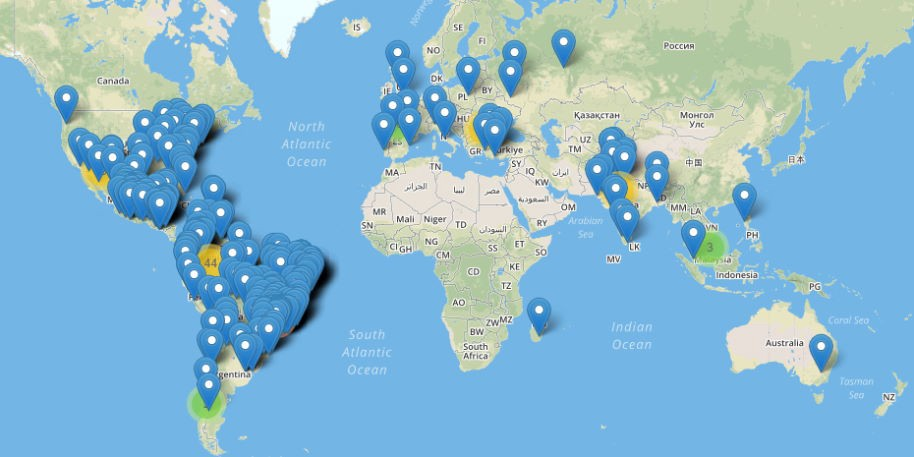

  Some of the trans people we have lost to violence or suicide in the past year.

The Transgender Day of Remembrance (TDoR) is here again, and with it, a whole collection of names and faces who have been lost to us in the past year.

The grief is never-ending; and with it the tears, resolve and anger not only about what happened to them, but about the attitudes, conditions, discrimination and violence that caused their deaths.

After all, the unofficial motto of TDoR is quite simply: ***“Remember Our Dead. Fight Like Hell for the Living”***.

----

We lose trans people for so many reasons. Some are killed by violent partners — a phenomenon also very familiar to cisgender women — some are killed while working as sex workers, often on the street (a profession many “choose” because they have no other choice, as regular employment is closed to them because of discrimination), and some are targetted by gangs or other criminals in the violent societies in which they live — often in poverty and fear. In some countries, being “out” is so dangerous that we never even hear about them.

**The end result is death.** *Lots* of death, and it is also worth remembering that for every case we hear about, there are undoubtedly several (or many?) others who we will never know about. So much depends on *if*, *where* and *how* the deaths of trans people are reported. Trans suicide victims, in particular, are notoriously under-reported.

----

This year the UK also lost [Amy Griffiths](https://tdor.translivesmatter.info/reports/2019/01/14/amy-griffiths_droitwich-worcestershire-united-kingdom_e780467d) to murder. It's small consolation that her murderer was caught and has been charged, but that obviously can't bring her back. **Rest in power, Amy.**

But the UK is by far one of the *safer *places. Latin America and USA are where we have the most data, and what we know is terrifying. The most sobering fact however is the fact that among the most dangerous places are likely to be places we have very scant or no data on (e.g. the Middle East and most of Africa) simply because the environment is too hostile for trans NGOs and activist groups to openly exist.

  Geographical distribution of TDoR 2019 victims [source: [tdor.translivesmatter.info](https://tdor.translivesmatter.info/reports/tdor2019?country=all&view=map&filter=)]

----

This blogpost gives details of **trans people we know to have been killed during the period 1st October 2018 to 30th September 2019**.

I have also included details of a handful of those known to have been lost to suicide, have died in custody (it should be no surprise that the few trans people who end up incarcerated have a really, really bad time in prisons) or backstreet surgical procedures, although as most cases are not reported (*or not reported as being deaths of trans people*), very few cases are listed here by comparison with the number killed directly by others.

The contents of the memorial list of victims released by **[Transgender Europe](https://tdor.tgeu.org/)** (TGEU) in early November 2019 in preparation for TDoR events worldwide is also included — although it's worth noting that several issues with the data it represents (several duplicate entries, and two misreports of cases from previous years) have been filtered out in the process.

The end result is **369** names. *

369 names of people whose lives have been cut short.

369 names of people who we'll never be able to meet or get to know

369 names of people whose true potential is forever lost to the world.

* We are still learning of additional cases, so this number is likely to rise further.

The numbers this year are significantly down, but please don't read anything in that — things really haven't improved noticeably.

For example, a brief look at the numbers for Brazil during TDoR 2019 (148) vs TDoR 2018 (185) immediately makes me wonder if the change is largely correlated with the level of resilience of a handful of hate crime researchers and activists.

In Brazil, the single volunteer running the site **[Who Has Homophobia Killed Today?](https://homofobiamata.wordpress.com/)** — a site which published details of *every* reported murder or suicide of an LGBT+ person they could find between 2016 and 2018 — retired at the beginning of 2019. His loss of very keenly felt, but it's not surprising — I myself can vouch for the fact that reading about that level of horror *every single day* really takes its toll on people.

Furthermore, during 2019 another of the Brazilian monitoring groups dramatically reduced their own monitoring. Compare the [level of detail of reports published by RedeTransBrasil ](https://web.archive.org/web/20191224084436/http://redetransbrasil.org.br/category/assassinatos/) during 2019 with that [published in previous years](https://web.archive.org/web/20170331234505/http://redetransbrasil.org/assassinatos.html).

All of that feeds through into the data published by TGEU and the list of victims remembered every November at TDoR vigils worldwide.

So I would caution against reading anything into the specific numbers. Given how poor the reporting of trans violence is worldwide and how few activists and volunteers have the stomach to research this subject, they are likely to be a **severe** underestimate.

What matters most is not how many or few of them there are, but that *we remember them, and do what we can to change things for the better.*

----

**[TRIGGER WARNING: VIOLENCE. MURDER]**

* [October 2018](https://tdor.translivesmatter.info/reports/2018/10)
* [November 2018](https://tdor.translivesmatter.info/reports/2018/11)
* [December 2018](https://tdor.translivesmatter.info/reports/2018/12)
* [January 2019](https://tdor.translivesmatter.info/reports/2019/01)
* [February 2019](https://tdor.translivesmatter.info/reports/2019/02)
* [March 2019](https://tdor.translivesmatter.info/reports/2019/03)
* [April 2019](https://tdor.translivesmatter.info/reports/2019/04)
* [May 2019](https://tdor.translivesmatter.info/reports/2019/05)
* [June 2019](https://tdor.translivesmatter.info/reports/2019/06)
* [July 2019](https://tdor.translivesmatter.info/reports/2019/07)
* [August 2019](https://tdor.translivesmatter.info/reports/2019/08)
* [September 2019](https://tdor.translivesmatter.info/reports/2019/09)

* **[Total: 369](https://tdor.translivesmatter.info/reports/tdor2019)**

If anyone has details to add, *please* let me know and I'll do what I can to help make sure that they will be remembered.

No matter who they were, we mourn and miss every single one of them.

Related blogposts for previous years are given below:

[@preview TDoR 2018: Say their names. Read their stories. Remember them](/blog/2018/12/24/tdor-2018-say-their-names-read-their-stories-remember-them_0da1b178)

[@preview TDoR 2017: Say their names. Learn their stories. Remember them](/blog/2017/11/24/tdor-2017-say-their-names-read-their-stories-remember-them_94cc5399)

[@preview Remembering Our Dead never gets any easier](/blog/2017/11/16/remembering-our-dead-never-gets-any-easier_580bd388)

Raw data for TDoR 2019 can be downloaded from **[https://tdor.translivesmatter.info/reports/tdor2019](https://tdor.translivesmatter.info/reports/tdor2019)**.

----

***About The Author***

*[Anna-Jayne Metcalfe](https://www.annasplace.me.uk/about) is a software engineer who volunteers to help research, collate and share data on violence against trans people. This blogpost was originally published by Anna on [Medium](https://annajayne.medium.com/tdor-2019-say-their-names-read-their-stories-remember-them-f353504aa37f).*
