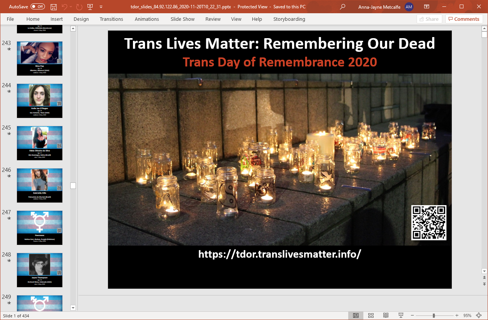

  Some of the trans people we have lost to violence or suicide in the past year.

Transgender Day of Remembrance (TDoR) feels different this year of necessity. After all, how could it not, when a pandemic is ravaging the globe and so many - including all of us here in the UK - will be locked down on 20th November?

So this year there are no outdoor candelight vigils. No faffing around with PA systems and running cables from nearby cafes. No freezing cold feet and hands in the cold wind and night air of a British November. No gathering together at all.

We're locked down, so instead, we'll be sitting on our sofa or at the kitchen table watching presentations on YouTube or taking part in Zoom calls trying to console each other.

Some things never change though - with November always comes the awareness of a whole new collection of names and faces who have been lost to us during the past year.

The grief is never-ending; and with it, the tears, resolve and anger not only about what happened to them but also about the attitudes, conditions, discrimination and violence that caused their deaths.

In a year when far too many trans people worldwide have been forced out onto the street to work alongside a silent killer virus, the unofficial TDoR motto of TDoR of ***“Remember Our Dead. Fight Like Hell for the Living”*** feels more apt than ever.

----

Unlike TDoR 2019 (**[rest in power, Amy](https://tdor.translivesmatter.info/reports/2019/01/14/amy-griffiths_droitwich-worcestershire-united-kingdom_e780467d)**) there were - as far as we know - no UK trans victims of murder this past year (though it is worth mentioning that the UK Office for National Statistics states that *“[it is not possible to identify transgender victims in current homicide statistics](https://twitter.com/BlueMouseEeek/status/1329698202707238912)”*).

However, as usual the UK claimed trans lives in other ways. As of right now, I know of two confirmed cases of suicide - and two cases in which an inquest is pending. There are undoubtedly others.

One of those is four is someone - [Bella ](https://twitter.com/eatenbyawhale)- I knew through Twitter. Had she not passed away, I'm certain our paths would have crossed at Trans Pride sometime, and her death came as a huge shock to the UK [#TransTwitter ](https://twitter.com/hashtag/TransTwitter)community.

<iframe width="560" height="315" src="https://www.youtube.com/embed/SKUzv08QGjU" frameborder="0" allowfullscreen></iframe>

Transgender Europe reported **350** killings of trans people in the past year, but we only saw their official list of the names of the victims on 10th November 2020.

Once we received the data set I started the difficult task of checking it (a task that took nearly 3 days) and merged it with our own.

That process led to the discovery of some duplicate/erroneous entries on the TGEU TDoR list, and I naturally attempted to identify others and filter them out.

For example, the following entry actually relates to a TDoR 2019 case on 19 May 2019:

* *#212: 18-May-2020 - Jesusa Fidel Ventura Reyes (Veracruz, Mexico).
See: [https://tdor.translivesmatter.info/reports/2019/05/19/jesusa-ventura-reyes_fortin-veracruz-mexico_5e6154e8](https://tdor.translivesmatter.info/reports/2019/05/19/jesusa-ventura-reyes_fortin-veracruz-mexico_5e6154e8)*

There were also 10 pairs of entries which were duplicates of each other:

* *\#9: 11-Oct-2019 - Vidalia Molina Delgado (Mazatenango, Guatemala) and \#13: 13-Oct-2019 - Name Unknown (Suchitepéquez, El Salvador) - Suchitepéquez is in Guatemala, not El Salvador.
See: [https://tdor.translivesmatter.info/reports/2019/10/11/vidalia-molina-delgado_mazatenango-suchitepequez-guatemala_08a66866](https://tdor.translivesmatter.info/reports/2019/10/11/vidalia-molina-delgado_mazatenango-suchitepequez-guatemala_08a66866)*

* *\#88: 16-Jan-2020 - Briyit Michelle Alas (San Salvador, El Salvador) and \#91: 17-Jan-2020 - Name Unknown (San Salvador, El Salvador).
See: [https://tdor.translivesmatter.info/reports/2020/01/16/briyit-michelle-alas-miranda_san-salvador-el-salvador_5720a950](https://tdor.translivesmatter.info/reports/2020/01/16/briyit-michelle-alas-miranda_san-salvador-el-salvador_5720a950)*

* *\#130: 2 Mar 2020 - Alexa Murder (Toa Baja, Puerto Rico) and \#137: 2 Feb 2020 - Alexa Negrón Luciano (Toa Baja, Puerto Rico).
See: [https://tdor.translivesmatter.info/reports/2020/02/24/alexa-negron-luciano-neulisa-luciano-ruiz_toa-baja-puerto-rico_c8603ef0](https://tdor.translivesmatter.info/reports/2020/02/24/alexa-negron-luciano-neulisa-luciano-ruiz_toa-baja-puerto-rico_c8603ef0)*

* *\#193: 29-Apr-2020 - Diamante (Veracruz, Mexico) and \#201: 6-May-2020 - Teresa C (Cosoleacaque, Mexico).
See: [https://tdor.translivesmatter.info/reports/2020/04/29/teresa-del-castillo-diamante_cosoleacaque-veracruz-mexico_1c91e545](https://tdor.translivesmatter.info/reports/2020/04/29/teresa-del-castillo-diamante_cosoleacaque-veracruz-mexico_1c91e545)*

* *\#159: 23-Mar-2020 - Karla Valentina N (San Felipe, Mexico) and \#221: 31-May-2020 - Valentina Ferrety (Salamanca, Guanajuato, Mexico). See: [https://tdor.translivesmatter.info/reports/2020/03/23/karla-camarena-del-castillo-valentina-ferrety_san-felipe-guanajuato-mexico_6b6ffe1e](https://tdor.translivesmatter.info/reports/2020/03/23/karla-camarena-del-castillo-valentina-ferrety_san-felipe-guanajuato-mexico_6b6ffe1e)*

* *\#175: 11-Apr-2020 - Ana Karen Velasco Castelán (Veracruz, Mexico) and \#178: 11-Apr-2020 - Name Unknown (Veracruz, Mexico).
See: [https://tdor.translivesmatter.info/reports/2020/04/11/ana-karen-velasco-castelan_veracruz-mexico_375295c6](https://tdor.translivesmatter.info/reports/2020/04/11/ana-karen-velasco-castelan_veracruz-mexico_375295c6)*

* *\#230: 14-Jun-2020 - Ariadna Ojeda (Santa Marta, Colombia) and \#233: 14-Jun-2020 - Ariadna (Santa Marta, Colombia).
See: [https://tdor.translivesmatter.info/reports/2020/06/13/ariadna-ojeda_santa-marta-magdalena-colombia_d6582fec](https://tdor.translivesmatter.info/reports/2020/06/13/ariadna-ojeda_santa-marta-magdalena-colombia_d6582fec)*

* *\#282: 4-Aug-2020 - Brenda Venegas Ayquipa (Lima, Peru) and \#320: 31-Aug-2020 - Brenda Levi (San Juan Luringancho, Peru).
See: [https://tdor.translivesmatter.info/reports/2020/08/04/brenda-venegas-ayquipa-brenda-levi_san-juan-de-lurigancho-lima-peru_d69cde93](https://tdor.translivesmatter.info/reports/2020/08/04/brenda-venegas-ayquipa-brenda-levi_san-juan-de-lurigancho-lima-peru_d69cde93)*

* *\#306: 22-Aug-2020 - Lorena María del Luján Riquel (Rosario, Argentina) and \#308: 22-Aug-2020 - Name Unknown (Santa Fe, Argentina).
See: [https://tdor.translivesmatter.info/reports/2020/08/22/lorena-maria-del-lujan-riquel_rosario-santa-fe-argentina_85a03a42](https://tdor.translivesmatter.info/reports/2020/08/22/lorena-maria-del-lujan-riquel_rosario-santa-fe-argentina_85a03a42)*

* *\#310: 24-Aug-2020 - Name Unknown (Acapulco, Mexico) and \#321: 31-Aug-2020 - Name Unknown (Acapulco, Mexico).
See: [https://tdor.translivesmatter.info/reports/2020/08/24/name-unknown_acapulco-guerrero-mexico_1b12b24c](https://tdor.translivesmatter.info/reports/2020/08/24/name-unknown_acapulco-guerrero-mexico_1b12b24c)*

As a result of this process the *effective* total number of cases on the TGEU memorial list went down from 350 to **339**.

In addition I noticed that some remarks were transposed between entries and there were some causes of death which did not seem to match up to the available source information.

All entries were checked against original sources where available, and the data referenced below reflects that.

If by this point you are thinking that Transgender Europe (TGEU) could possibly have checked the data more carefully, I think it's worth remembering that TGEU are a trans-led organisation which I suspect has very limited resources. Furthermore, **collating reports of violence against trans people is *very* hard**, and errors can creep in easily. I have no doubt that they are just trying to do their best with very limited resources.

If you want to learn more about the people behind their **Trans Murder Monitoring Project**, I recommend you read [https://tgeu.org/about-us/](https://tgeu.org/about-us/).

----

But even before it was published we knew most of the names on the TDoR 2020 memorial list already.

***We already knew them*** because of the many trans people and groups posting to social media, talking to each other and sharing their memories of those who they had lost.

***We already knew them*** because of social media posts and articles by families mourning their murdered trans children and siblings.

***We already knew them*** because of the (often sparse and laden with stereotypes and misgendering) news reports we have seen in our RSS feeds throughout the year.

***We already knew them*** because automated translation engines had made it possible to read about them even when we do not even speak the same languages.

***We already knew them*** because *after so many years we knew where to look to find news of what happened to them.*

The deaths of those we have lost this year follow a familiar pattern.

***Beaten, shot or stabbed in the street or at home*** - either by clients, gangs, police or partners or ex-partners.

***Being taken by friends from one hospital to another to try to get medical attention after clinicians refused to treat them or to take them to hospital in an ambulance.***

***Suspicious deaths and murders being reported as suicides.***

***Being disrespected or erased in death*** - by the authorities and media, but also far too often by their own families.

**The end result is the same.**

  Geographical distribution of TDoR 2020 victims [source: [tdor.translivesmatter.info](https://tdor.translivesmatter.info/reports?from=2019-10-01&to=2020-09-30&country=all&category=all&view=map&filter=)]

----

It is always worth reiterating that direct violence of the kind reported in the yearly TGEU TDoR memorial list is only ever part of the story. A trans person who dies from suicide or from COVID-19 - after being forced to go on the street to do sex work during a pandemic to earn money to buy food and pay rent - is no less dead, and no less worthy of being remembered.

So our list is longer than the official TDoR list. Of course, it is far from definitive - far too often trans people die without anyone noticing (or the media, authorities and/or families actively try to erase their lives through misgendering and deadnaming.

As such those whose deaths *are* reported represent just the tip of a very large iceberg.

----

**[TRIGGER WARNING: VIOLENCE. MURDER]**

* [October 2019](https://tdor.translivesmatter.info/reports/2019/10) (28)
* [November 2019](https://tdor.translivesmatter.info/reports/2019/11) (26)
* [December 2019](https://tdor.translivesmatter.info/reports/2019/12) (28)
* [January 2020](https://tdor.translivesmatter.info/reports/2020/01) (44)
* [February 2020](https://tdor.translivesmatter.info/reports/2020/02) (40)
* [March 2020](https://tdor.translivesmatter.info/reports/2020/03) (38)
* [April 2020](https://tdor.translivesmatter.info/reports/2020/04) (34)
* [May 2020](https://tdor.translivesmatter.info/reports/2020/05) (32)
* [June 2020](https://tdor.translivesmatter.info/reports/2020/06) (38)
* [July 2020](https://tdor.translivesmatter.info/reports/2020/07) (38)
* [August 2020](https://tdor.translivesmatter.info/reports/2020/08) (50)
* [September 2020](https://tdor.translivesmatter.info/reports/2020/09) (36)

* **[Total: 432](https://tdor.translivesmatter.info/reports/tdor2020)**

The reports linked above can be categorised as follows:

* Deaths in custody: **2**

* Medical (including COVID-19): **25**

* Suicide: **48**

* Uncategorised: **24** (many of whom are likely to have been victims of violence, but without more detailed source reports we couldn't tell)

* Direct violence: **333**

For these few we know about there is at least some chance they will be remembered.

Is that any consolation? I don't know.

If anyone has details to add, *please* let me know and I'll do what I can to help make sure that they will be remembered.

No matter who they were, we mourn and miss every single one of them.

----

Resources for TDoR 2020 - including raw data, photos of those we've lost and and Powerpoint slides (see the screenshot below) - can be downloaded from:

**[https://tdor.translivesmatter.info/reports/tdor2020](https://tdor.translivesmatter.info/reports/tdor2020)**

  Slides for TDoR 2020 can be downloaded from [https://tdor.translivesmatter.info](https://tdor.translivesmatter.info).

----

I'll finish with a goodbye - not to you, the reader - but to **[Bella](https://tdor.translivesmatter.info/reports/2020/08/16/isabella-bellusci-bella_manchester-united-kingdom_f86e1953)**, on behalf of all of us on UK [#TransTwitter](https://twitter.com/hashtag/TransTwitter).

<blockquote class="twitter-tweet">
Trans women are women ❤️ <a href="https://t.co/QeQkaZY6ka">pic.twitter.com/QeQkaZY6ka</a>
&mdash; Bella Witch (@eatenbyawhale) <a href="https://twitter.com/eatenbyawhale/status/1280804279096348672?ref_src=twsrc%5Etfw">July 8, 2020</a></blockquote>

*We miss you*. 😢

----

Related blogposts are linked below:

[@preview TDoR 2019: Say their names. Read their stories. Remember them](/blog/2019/11/20/tdor-2019-say-their-names-read-their-stories-remember-them_1ac64f27)

[@preview TDoR 2018: Say their names. Read their stories. Remember them](/blog/2018/12/24/tdor-2018-say-their-names-read-their-stories-remember-them_0da1b178)

[@preview TDoR 2017: Say their names. Read their stories. Remember them](/blog/2017/11/24/tdor-2017-say-their-names-read-their-stories-remember-them_94cc5399)

[@preview Remembering Our Dead Never Gets Any Easier](/blog/2017/11/16/remembering-our-dead-never-gets-any-easier_580bd388)

---

***About The Author***

*[Anna-Jayne Metcalfe](https://www.annasplace.me.uk/about) is a software engineer who volunteers to help research, collate and share data on violence against trans people. This blogpost was originally published by Anna on [Medium](https://annajayne.medium.com/tdor-2020-say-their-names-read-their-stories-remember-them-a6ceed20f6ee).*
