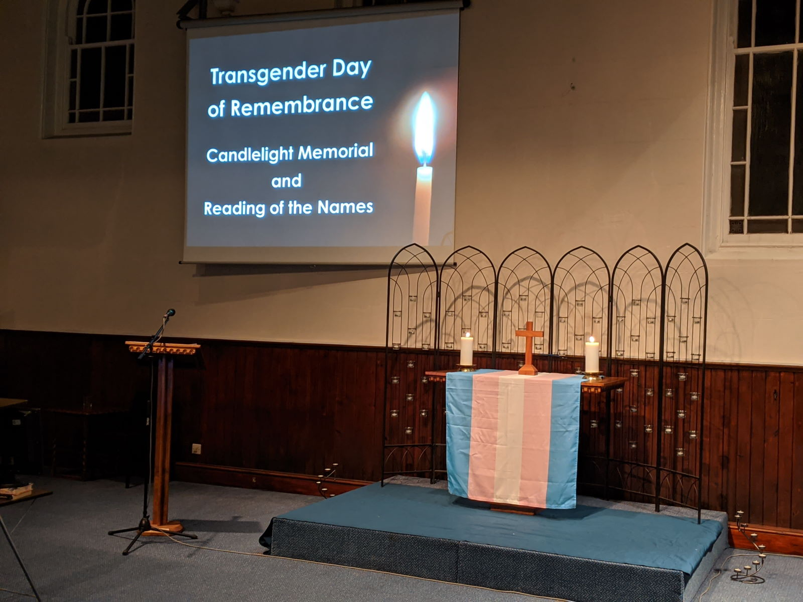
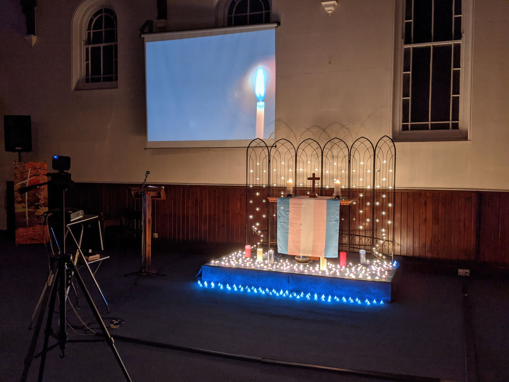
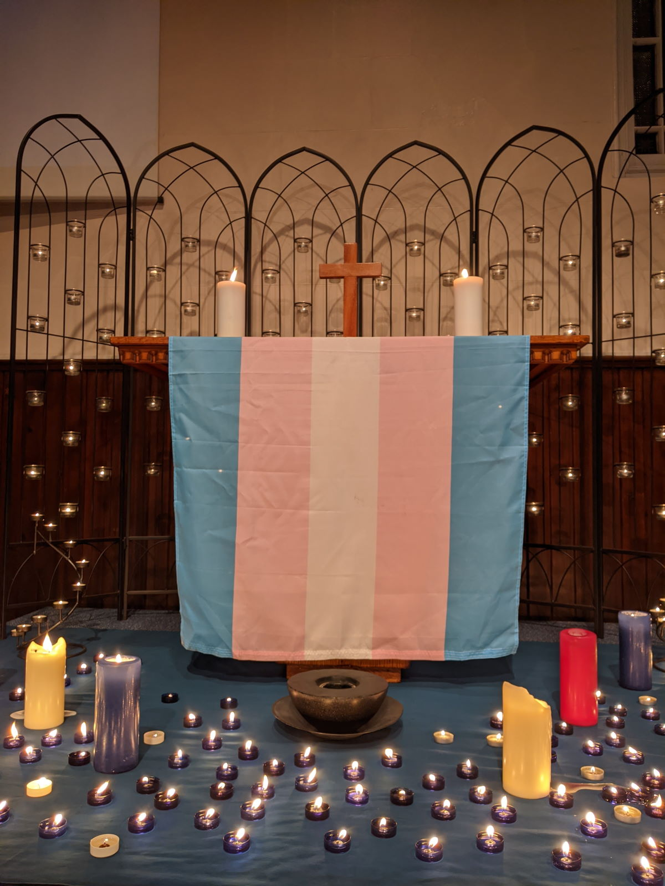
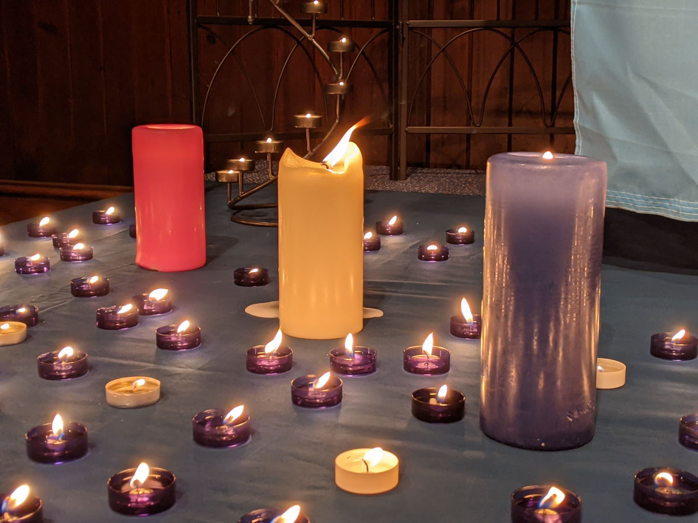

Today is **Trans Day of Remembrance 2020**.

<blockquote class="twitter-tweet">
<a href="https://twitter.com/hashtag/TDoR2020?src=hash&amp;ref_src=twsrc%5Etfw">#TDoR2020</a> is today.  Today is the day we remember our fallen. It will be marked by us, but ignored by far too many.  On this day above all others, *please* stand with us.<a href="https://twitter.com/hashtag/SayTheirNames?src=hash&amp;ref_src=twsrc%5Etfw">#SayTheirNames</a> <a href="https://twitter.com/hashtag/TransLivesMatter?src=hash&amp;ref_src=twsrc%5Etfw">#TransLivesMatter</a> <a href="https://twitter.com/hashtag/TDoR?src=hash&amp;ref_src=twsrc%5Etfw">#TDoR</a> <a href="https://t.co/EaMv0Y7RVN">https://t.co/EaMv0Y7RVN</a> <a href="https://t.co/nRwVwTrCyz">pic.twitter.com/nRwVwTrCyz</a>
&mdash; TransLivesMatter (@TDoRinfo) <a href="https://twitter.com/TDoRinfo/status/1329744106545950723?ref_src=twsrc%5Etfw">November 20, 2020</a></blockquote>

I've spent much of the last year preparing for today.

Researching, collating and sharing news reports about trans people we have lost to violence in its many forms. Raising awareness. Updating the [**tdor.translivesmatter.info**](https://tdor.translivesmatter.info) website. Supporting others, and letting them support me.

It's been *hard*, but now it's finally over.

Last night we held a [livestream #TDoR memorial service](https://www.youtube.com/watch?v=1bKpc2STTos) at Inclusive Community Church here in Bournemouth.

<iframe width="560" height="315" src="https://www.youtube.com/embed/1bKpc2STTos" frameborder="0" allow="accelerometer; autoplay; clipboard-write; encrypted-media; gyroscope; picture-in-picture" allowfullscreen></iframe>

&nbsp;

After reading all of the [432](http://tdor.translivesmatter.info/reports/tdor2020) names we had my voice feels a little hoarse now so Lemon & Ginger tea with honey is probably a good idea!

  The Trans Day of Remembrance 2020 memorial service at [Inclusive Community Church](https://www.inclusive.church/tdor/).

Unfortunately the killings and suicides don't ever stop, so the names we will be saying at [TDoR 2021](http://tdor.translivesmatter.info/reports/tdor2021) are *already* starting to mount up.

But - at least for now - it's time to rest. Please be safe out there.

***About The Author***

*[Anna-Jayne Metcalfe](https://www.annasplace.me.uk/about) is a software engineer who volunteers to help research, collate and share data on violence against trans people. This blogpost was originally published by Anna on her [personal blog](https://www.annasplace.me.uk/blog/?archive=2020_11_01_archive.xml#2020112001).*

